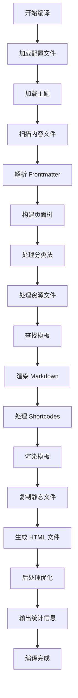
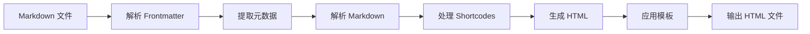
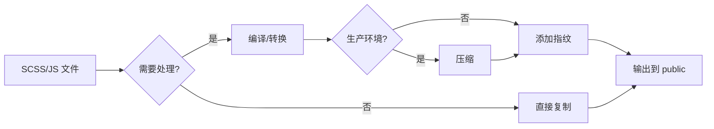
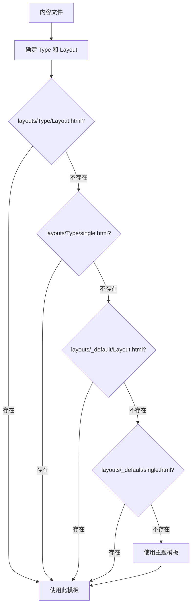

# Hugo 编译过程详细讲解

## 📖 目录

1. [概述](#概述)
2. [编译流程总览](#编译流程总览)
3. [详细阶段说明](#详细阶段说明)
4. [实际示例演示](#实际示例演示)
5. [编译流程图解](#编译流程图解)
6. [关键特性详解](#关键特性详解)
7. [常见问题与调试](#常见问题与调试)
8. [性能优化建议](#性能优化建议)
9. [总结](#总结)

---

## 概述

Hugo 编译是将 Markdown 内容、模板文件、静态资源等转换为静态 HTML 网站的过程。这个过程涉及多个阶段，从读取配置文件到最终生成静态文件。

### 编译的本质

Hugo 编译过程本质上是一个**静态网站生成流水线**：

```
源文件（Markdown + 模板 + 资源）
    ↓
解析与处理
    ↓
渲染与组合
    ↓
静态 HTML 文件
```

### 编译特点

- ⚡ **极速构建**：通常只需几十毫秒到几秒
- 🔄 **增量构建**：只处理更改的文件
- 🚀 **并行处理**：自动利用多核 CPU
- 💾 **智能缓存**：减少重复处理

---

## 编译流程总览

Hugo 编译过程可以分为以下**10个主要阶段**：

1. **初始化阶段**：读取配置、加载主题、建立站点结构
2. **内容收集阶段**：扫描 content 目录、解析 frontmatter、构建页面树
3. **资源处理阶段**：处理 assets 目录中的资源文件（CSS、JS、图片等）
4. **模板查找阶段**：根据内容类型查找合适的模板
5. **Markdown 渲染阶段**：将 Markdown 转换为 HTML
6. **模板渲染阶段**：将内容与模板结合生成 HTML
7. **静态文件复制阶段**：复制 static 目录中的文件
8. **输出文件生成阶段**：生成最终文件到 public 目录
9. **后处理与优化阶段**：压缩、指纹、清理等
10. **构建统计与完成阶段**：输出统计信息

---

## 详细阶段说明

### 阶段 1：初始化与配置加载

#### 1.1 配置文件读取

**查找顺序**：

Hugo 按以下顺序查找并加载配置文件：

1. `hugo.toml` / `config.toml`（根目录，优先级最高）
2. `config/` 目录下的配置文件（按环境合并）
   - `config/_default/` - 默认配置（基础配置）
   - `config/development/` - 开发环境配置
   - `config/production/` - 生产环境配置

**配置合并规则**：

```
最终配置 = _default 配置 + 环境配置（覆盖）
```

**实际示例**：

假设有以下配置结构：

```
config/
├── _default/
│   ├── hugo.toml      # baseURL = 'http://localhost:1313/'
│   └── params.toml    # theme = 'hugo-book'
└── production/
    └── hugo.toml      # baseURL = 'https://example.com/'
```

当使用 `hugo --environment production` 时：
- 先加载 `_default/hugo.toml` → baseURL = 'http://localhost:1313/'
- 再加载 `production/hugo.toml` → baseURL = 'https://example.com/'（覆盖）
- 最终 baseURL = 'https://example.com/'

**处理内容**：

1. **解析配置格式**：
   - TOML（推荐）：`hugo.toml`
   - YAML：`hugo.yaml`
   - JSON：`hugo.json`

2. **验证配置有效性**：
   - 检查必需字段（如 `baseURL`）
   - 验证路径是否存在
   - 检查语法错误

3. **设置默认值**：
   - 如果未指定，使用 Hugo 内置默认值
   - 例如：`theme = ""`（无主题）

#### 1.2 主题加载

**处理流程**：

1. **检查主题配置**：
   ```toml
   theme = "hugo-book"
   ```

2. **查找主题目录**：
   - 在 `themes/` 目录查找
   - 支持多个主题（用逗号分隔）

3. **加载主题资源**：
   - 读取主题的 `theme.toml`
   - 加载主题的 `layouts/`、`static/`、`assets/` 等

4. **建立文件合并优先级**：
   ```
   站点根目录 > 主题目录
   ```

**合并规则**：

- **同名文件**：站点文件**替换**主题文件
- **不同名文件**：站点和主题文件**叠加**保留
- **只有完全相同的路径才会被覆盖**

**优先级示例**：

```
站点文件：layouts/_default/single.html
主题文件：themes/hugo-book/layouts/_default/single.html

结果：使用站点文件（完全替换主题文件）
```

> 💡 **详细说明**：关于目录合并机制的完整说明，请参见[目录合并机制](#目录合并机制)章节。

#### 1.3 目录结构验证

**必需目录检查**：

- ✅ `content/` - 内容目录（必需，否则无内容可构建）
- ⚠️ `layouts/` - 模板目录（可选，覆盖主题模板）
- ⚠️ `static/` - 静态文件目录（可选）
- ⚠️ `assets/` - 资源文件目录（可选，需处理）
- ⚠️ `themes/` - 主题目录（如果使用主题）

**目录结构示例**：

```
my-site/
├── content/          # ✅ 必需
│   ├── _index.md
│   └── posts/
├── layouts/          # ⚠️ 可选（覆盖主题）
│   └── _default/
├── static/           # ⚠️ 可选
│   └── images/
├── assets/           # ⚠️ 可选（需处理）
│   └── _custom.scss
├── themes/           # ⚠️ 可选
│   └── hugo-book/
└── hugo.toml         # ✅ 必需
```

---

### 阶段 2：内容收集与解析

#### 2.1 内容文件扫描

**扫描过程**：

1. **递归扫描** `content/` 目录
2. **识别文件类型**：
   - Markdown 文件：`.md`, `.markdown`
   - 特殊文件：`_index.md`（章节索引）

3. **文件分类**：
   - **页面文件**：普通 `.md` 文件
   - **章节索引**：`_index.md` 文件
   - **草稿文件**：`draft: true` 的文件（默认不构建）

**实际扫描示例**：

假设 `content/` 目录结构：

```
content/
├── _index.md                    # 首页
├── posts/
│   ├── _index.md                # posts 章节页
│   ├── post-1.md                 # 普通页面
│   └── draft-post.md             # 草稿（draft: true）
└── docs/
    ├── _index.md                 # docs 章节页
    └── getting-started.md         # 普通页面
```

**扫描结果**：

- 找到 6 个 Markdown 文件
- 识别 3 个 `_index.md`（首页 + 2 个章节页）
- 识别 1 个草稿文件（默认跳过）

#### 2.2 Frontmatter 解析

**格式识别**：

Hugo 通过分隔符识别 Frontmatter 格式：

1. **TOML 格式**：`+++` 包围
   ```toml
   +++
   title = "文章标题"
   date = 2026-01-25T10:00:00+08:00
   draft = false
   +++
   ```

2. **YAML 格式**：`---` 包围（最常用）
   ```yaml
   ---
   title: "文章标题"
   date: 2026-01-25T10:00:00+08:00
   draft: false
   ---
   ```

3. **JSON 格式**：`{}` 包围
   ```json
   {
     "title": "文章标题",
     "date": "2026-01-25T10:00:00+08:00",
     "draft": false
   }
   ```

**解析过程**：

对每个内容文件：

1. **分离 Frontmatter 和内容**：
   ```
   文件内容 = Frontmatter + 分隔符 + Markdown 内容
   ```

2. **提取元数据**：
   - 标准字段：`title`, `date`, `draft`, `weight` 等
   - 自定义参数：`params.custom_field`
   - 分类法：`tags`, `categories`
   - 菜单配置：`menu`

3. **验证与默认值**：
   - 检查必需字段
   - 应用默认值（如 `draft = false`）
   - 日期格式化

**实际解析示例**：

源文件 `content/posts/my-post.md`：

```yaml
---
title: "我的第一篇文章"
date: 2026-01-25T10:00:00+08:00
draft: false
tags:
  - Hugo
  - 博客
categories:
  - 技术
weight: 10
---
# 我的第一篇文章

这是文章内容...
```

**解析结果**：

```go
Page {
  Title: "我的第一篇文章",
  Date: 2026-01-25T10:00:00+08:00,
  Draft: false,
  Tags: ["Hugo", "博客"],
  Categories: ["技术"],
  Weight: 10,
  Content: "<h1>我的第一篇文章</h1><p>这是文章内容...</p>"
}
```

#### 2.3 页面树构建

**构建过程**：

1. **建立层级关系**：
   根据文件路径建立父子关系

2. **识别页面类型（Kind）**：
   - `home` - 首页（`content/_index.md`）
   - `section` - 章节页（`content/posts/_index.md`）
   - `page` - 普通页面
   - `taxonomy` - 分类法列表页
   - `term` - 分类法项页面

3. **建立关联关系**：
   - 父页面包含子页面列表（`.Pages`）
   - 子页面包含父页面引用（`.Parent`）

4. **排序处理**：
   - 优先按 `weight` 排序（数字越小越靠前）
   - 其次按 `date` 排序（日期越新越靠前）
   - 最后按文件名排序

**页面树示例**：

```
首页 (home)
├── posts/ (section)
│   ├── post-1.md (page)
│   └── post-2.md (page)
└── docs/ (section)
    ├── getting-started.md (page)
    └── advanced.md (page)
```

**实际项目示例**：

从项目 `content/docs/Theory/theory-of-modern-control/1-状态空间表达式.md`：

```yaml
---
title: "1-状态空间表达式"
weight: 1
---
```

构建结果：
- 页面类型：`page`
- 父页面：`content/docs/Theory/theory-of-modern-control/_index.md`
- 排序：按 `weight: 1` 排序
- URL：`/docs/theory/theory-of-modern-control/1-状态空间表达式/`

#### 2.4 分类法（Taxonomy）处理

**处理内容**：

1. **提取分类法**：
   从所有页面的 frontmatter 提取 `tags` 和 `categories`

2. **自动创建分类法页面**：
   - `content/tags/_index.md` → 标签列表页
   - `content/tags/hugo/_index.md` → 特定标签页

3. **建立关联**：
   - 页面 → 标签（多对多关系）
   - 标签 → 页面列表

**分类法示例**：

假设有以下页面：

```yaml
# post-1.md
tags: ["Hugo", "博客"]

# post-2.md
tags: ["Hugo", "教程"]
```

**处理结果**：

- 创建标签列表页：`/tags/`
- 创建标签页：
  - `/tags/hugo/`（包含 post-1 和 post-2）
  - `/tags/博客/`（包含 post-1）
  - `/tags/教程/`（包含 post-2）

---

### 阶段 3：资源处理（Assets Pipeline）

#### 3.1 资源文件识别

**扫描目录**：

- `assets/` 目录（站点）
- `themes/<theme>/assets/` 目录（主题）

**文件类型**：

- CSS/SCSS/SASS 文件（`.css`, `.scss`, `.sass`）
- JavaScript/TypeScript 文件（`.js`, `.ts`）
- 图片文件（用于处理，`.jpg`, `.png`, `.webp` 等）
- 其他资源文件

**实际项目示例**：

项目中的 `assets/_custom.scss`：

```scss
// 数学公式宽度控制
.katex-display {
  overflow: auto hidden;
  max-width: 100%;
  margin: 1em 0;
}
```

#### 3.2 资源处理流程

**处理步骤**：

1. **SCSS/SASS 编译**：
   ```
   assets/_custom.scss 
   → 编译为 CSS（使用 Dart Sass）
   → 输出到 resources/_gen/assets/css/_custom_*.css
   ```

2. **JavaScript 处理**：
   - 合并多个 JS 文件（如果使用 bundle）
   - 压缩（如果启用 minify）
   - 添加指纹（fingerprint）用于缓存

3. **图片处理**：
   - 调整大小（resize）
   - 格式转换（WebP、AVIF）
   - 生成响应式图片集

4. **资源管道**：
   ```go
   {{ $css := resources.Get "css/style.scss" 
      | resources.ToCSS 
      | resources.Minify 
      | resources.Fingerprint }}
   <link rel="stylesheet" href="{{ $css.RelPermalink }}">
   ```

**实际处理示例**：

模板中的资源处理：

```go
{{ $customCSS := resources.Get "_custom.scss" | resources.ToCSS }}
{{ if hugo.IsProduction }}
  {{ $customCSS = $customCSS | resources.Minify | resources.Fingerprint }}
{{ end }}
<link rel="stylesheet" href="{{ $customCSS.RelPermalink }}">
```

**处理结果**：

- 开发环境：`/css/_custom.css`
- 生产环境：`/css/_custom.min.a1b2c3d4.css`（压缩 + 指纹）

#### 3.3 资源缓存

**缓存机制**：

- 处理后的资源存储在 `resources/_gen/` 目录
- 使用文件哈希判断是否需要重新处理
- 增量构建时只处理更改的资源

**缓存示例**：

```
resources/_gen/
├── assets/
│   └── css/
│       └── _custom_*.css    # 编译后的 CSS
└── images/
    └── processed/           # 处理后的图片
```

---

### 阶段 4：模板查找与选择

#### 4.1 模板查找规则

Hugo 使用**从具体到通用**的查找顺序：

**查找顺序**：

1. `layouts/<Type>/<Layout>.html`
2. `layouts/<Type>/single.html`
3. `layouts/_default/<Layout>.html`
4. `layouts/_default/single.html`
5. `themes/<theme>/layouts/...`（相同规则）

**实际查找示例**：

对于 `content/posts/my-post.md`：

1. ✅ `layouts/posts/single.html`（如果存在，使用）
2. ❌ `layouts/posts/_default/single.html`（不存在，继续）
3. ❌ `layouts/_default/single.html`（不存在，继续）
4. ✅ `themes/hugo-book/layouts/_default/single.html`（使用）

#### 4.2 模板类型

**主要模板类型**：

| 模板文件 | 说明 | 匹配内容 |
|---------|------|---------|
| `baseof.html` | 基础模板 | 所有页面的基础结构 |
| `index.html` | 首页模板 | `content/_index.md` |
| `single.html` | 单页模板 | 普通内容文件 |
| `list.html` | 列表页模板 | 章节页（`_index.md`） |
| `taxonomy.html` | 分类法列表模板 | 分类法列表页 |
| `term.html` | 分类法项模板 | 特定分类法项页 |
| `404.html` | 404 错误页模板 | 404 页面 |

#### 4.3 模板上下文准备

**准备数据**：

- 当前页面对象（`.Page`）：包含页面所有信息
- 站点信息（`.Site`）：站点配置和全局数据
- 菜单数据（`.Site.Menus`）：导航菜单
- 分类法数据（`.Site.Taxonomies`）：标签和分类
- 相关页面（`.Pages`, `.RegularPages`）：页面列表

**上下文示例**：

```go
// 在模板中可以访问：
{{ .Title }}              // 页面标题
{{ .Content }}            // 页面内容（HTML）
{{ .Site.Title }}         // 站点标题
{{ .Site.Menus.main }}    // 主菜单
{{ .Pages }}              // 子页面列表
```

---

### 阶段 5：Markdown 渲染

#### 5.1 Markdown 解析

**处理流程**：

1. **分离 frontmatter 和内容**
2. **使用 Goldmark 引擎解析 Markdown**
3. **处理扩展语法**：
   - 代码高亮（使用 Chroma）
   - 数学公式（KaTeX/MathJax）
   - 表格
   - 任务列表
   - 脚注
   - 定义列表

**实际解析示例**：

源 Markdown：

```markdown
# 标题

这是**粗体**文本。

```python
def hello():
    print("Hello, World!")
```

$$E = mc^2$$
```

**解析结果**（HTML）：

```html
<h1>标题</h1>
<p>这是<strong>粗体</strong>文本。</p>
<pre><code class="language-python">def hello():
    print("Hello, World!")
</code></pre>
<span class="katex">E = mc^2</span>
```

#### 5.2 Shortcode 处理

**处理步骤**：

1. **识别 Shortcode 语法**：
   - `` - 短代码（HTML 输出）
   - `{}` - 短代码（Markdown 输出）

2. **查找 Shortcode 文件**：
   - `layouts/_shortcodes/shortcode.html`（站点）
   - `themes/<theme>/layouts/_shortcodes/shortcode.html`（主题）

3. **执行 Shortcode 模板**
4. **替换原内容**

**实际示例**：

Markdown 内容：

```markdown

graph TD
    A[开始] --> B[处理]
    B --> C[结束]

```

**处理过程**：

1. 识别 `` Shortcode
2. 查找 `layouts/_shortcodes/mermaid.html`
3. 执行模板，生成 HTML：
   ```html
   <div class="mermaid">
   graph TD
       A[开始] --> B[处理]
       B --> C[结束]
   </div>
   <script src="/mermaid.min.js"></script>
   ```
4. 替换原 Shortcode 语法

#### 5.3 HTML 生成

**最终输出**：

- Markdown → HTML 片段
- 存储在 `.Content` 变量中
- 供模板使用

**内容变量**：

```go
{{ .Content }}        // 完整 HTML 内容
{{ .Summary }}        // 摘要（前 N 个字符）
{{ .Plain }}          // 纯文本内容
{{ .RawContent }}     // 原始 Markdown
```

---

### 阶段 6：模板渲染

#### 6.1 Go Template 引擎执行

**执行流程**：

1. **加载模板文件**
2. **解析模板语法**（`{{ }}`）
3. **执行控制结构**（`if`, `range`, `with`）
4. **输出变量和函数结果**
5. **处理模板继承**（`{{ block }}`, `{{ define }}`）

**模板语法示例**：

```go
{{ if .IsPage }}
  <h1>{{ .Title }}</h1>
{{ end }}

{{ range .Pages }}
  <article>
    <h2>{{ .Title }}</h2>
    <p>{{ .Summary }}</p>
  </article>
{{ end }}
```

#### 6.2 模板继承

**baseof.html 结构**：

```html
<!DOCTYPE html>
<html>
<head>
    <title>{{ .Title }} - {{ .Site.Title }}</title>
    {{ block "head" . }}{{ end }}
</head>
<body>
    {{ block "header" . }}{{ end }}
    <main>
        {{ block "main" . }}{{ end }}
    </main>
    {{ block "footer" . }}{{ end }}
</body>
</html>
```

**子模板**：

```html
{{ define "main" }}
    <h1>{{ .Title }}</h1>
    <div class="content">
        {{ .Content }}
    </div>
{{ end }}
```

**渲染结果**：

```html
<!DOCTYPE html>
<html>
<head>
    <title>我的文章 - 我的网站</title>
</head>
<body>
    <main>
        <h1>我的文章</h1>
        <div class="content">
            <p>文章内容...</p>
        </div>
    </main>
</body>
</html>
```

#### 6.3 部分模板（Partials）

**使用方式**：

```go
{{ partial "header.html" . }}
{{ partial "footer.html" . }}
```

**查找顺序**：

1. `layouts/_partials/header.html`（站点）
2. `themes/<theme>/layouts/_partials/header.html`（主题）

---

### 阶段 7：静态文件复制

#### 7.1 静态文件同步

**处理流程**：

1. 扫描 `static/` 目录（站点）
2. 扫描 `themes/<theme>/static/` 目录（主题）
3. 按优先级合并：
   - 站点 `static/` > 主题 `static/`
4. 复制到 `public/` 目录，保持目录结构

**文件类型**：

- 图片文件（`.jpg`, `.png`, `.svg` 等）
- PDF 文档
- 字体文件
- 其他不需要处理的文件

**复制示例**：

```
static/
└── images/
    └── logo.png

→ public/images/logo.png
```

#### 7.2 文件去重与合并

**合并规则**：

- **同名文件**：站点文件**替换**主题文件（站点优先）
- **不同名文件**：站点和主题文件**叠加**保留（都复制到 public）
- **只有完全相同的路径才会被覆盖**

**示例 1：同名文件（替换）**：

```
站点：static/favicon.ico
主题：themes/hugo-book/static/favicon.ico

结果：使用站点的 favicon.ico（完全替换）
```

**示例 2：不同名文件（叠加）**：

```
站点 static/：
  └── images/logo.png

主题 themes/hugo-book/static/：
  └── css/style.css

结果（合并到 public/）：
  ├── images/logo.png    # 来自站点
  └── css/style.css      # 来自主题（都保留）
```

> 💡 **详细说明**：关于目录合并机制的完整说明，请参见[目录合并机制](#目录合并机制)章节。

---

### 阶段 8：输出文件生成

#### 8.1 HTML 文件生成

**生成规则**：

- 每个内容文件生成一个 HTML 文件
- URL 路径基于文件路径
- 输出到 `public/` 目录

**路径映射规则**：

```
content/posts/my-post.md
→ public/posts/my-post/index.html
→ URL: /posts/my-post/
```

**实际项目示例**：

```
content/docs/Theory/theory-of-modern-control/1-状态空间表达式.md
→ public/docs/theory/theory-of-modern-control/1-状态空间表达式/index.html
→ URL: /docs/theory/theory-of-modern-control/1-状态空间表达式/
```

#### 8.2 特殊页面生成

**自动生成的页面**：

1. **首页**：`content/_index.md` → `public/index.html`
2. **章节页**：`content/posts/_index.md` → `public/posts/index.html`
3. **分类法页**：
   - `content/tags/_index.md` → `public/tags/index.html`
   - `content/tags/hugo/_index.md` → `public/tags/hugo/index.html`

#### 8.3 站点地图和索引

**自动生成**：

- `sitemap.xml` - 搜索引擎站点地图
- `robots.txt` - 搜索引擎爬虫规则
- RSS/Atom feeds（如果配置）

**sitemap.xml 示例**：

```xml
<?xml version="1.0" encoding="UTF-8"?>
<urlset>
  <url>
    <loc>https://example.com/</loc>
    <lastmod>2026-01-25</lastmod>
  </url>
  <url>
    <loc>https://example.com/posts/my-post/</loc>
    <lastmod>2026-01-25</lastmod>
  </url>
</urlset>
```

#### 8.4 别名（Aliases）处理

**处理方式**：

```yaml
---
aliases:
  - /old-url/
  - /another-old-url/
---
```

**生成重定向页面**：

- `public/old-url/index.html` → 重定向到新 URL

**重定向 HTML**：

```html
<!DOCTYPE html>
<html>
<head>
    <title>Redirecting...</title>
    <link rel="canonical" href="/new-url/">
    <meta http-equiv="refresh" content="0; url=/new-url/">
</head>
<body>
    <h1>Redirecting...</h1>
    <a href="/new-url/">Click here if you are not redirected.</a>
</body>
</html>
```

---

### 阶段 9：后处理与优化

#### 9.1 HTML 压缩（Minify）

**如果启用 `--minify`**：

- 移除空白字符
- 压缩 HTML/CSS/JS
- 移除注释
- 优化属性

**压缩前**：

```html
<!DOCTYPE html>
<html>
<head>
    <title>我的网站</title>
</head>
<body>
    <h1>标题</h1>
</body>
</html>
```

**压缩后**：

```html
<!DOCTYPE html><html><head><title>我的网站</title></head><body><h1>标题</h1></body></html>
```

#### 9.2 资源指纹（Fingerprint）

**处理方式**：

```go
{{ $css := resources.Get "css/style.css" | resources.Fingerprint }}
<link rel="stylesheet" href="{{ $css.RelPermalink }}">
```

**效果**：

- 文件名添加哈希：`style.a1b2c3d4.css`
- 用于缓存控制（文件内容改变，哈希改变）

**实际输出**：

```html
<link rel="stylesheet" href="/css/style.a1b2c3d4.css">
```

#### 9.3 清理目标目录

**如果启用 `--cleanDestinationDir`**：

- 删除 `public/` 中不在源文件中的文件
- 确保输出目录干净

**清理示例**：

```
public/
├── old-page/          # 源文件已删除
└── new-page/          # 源文件存在

清理后：
public/
└── new-page/          # 只保留存在的页面
```

---

### 阶段 10：构建统计与完成

#### 10.1 构建统计

**输出信息**：

```
                   | EN
-------------------+-----
  Pages            | 25
  Paginator pages  |  0
  Non-page files   |  0
  Static files     | 10
  Processed images |  5
  Aliases          |  2
  Sitemaps         |  1
  Cleaned          |  0

Total in 45 ms
```

**统计说明**：

- **Pages**：生成的页面数量
- **Paginator pages**：分页器页面数量
- **Non-page files**：非页面文件（如 JSON、XML）
- **Static files**：静态文件数量
- **Processed images**：处理的图片数量
- **Aliases**：别名/重定向页面数量
- **Sitemaps**：站点地图数量
- **Cleaned**：清理的文件数量
- **Total**：总耗时

#### 10.2 错误处理

**错误类型**：

- 配置文件错误（语法错误、无效值）
- 模板语法错误（Go Template 语法错误）
- 内容文件格式错误（Frontmatter 格式错误）
- 资源处理错误（SCSS 编译错误、图片处理错误）

**处理方式**：

- 输出详细错误信息
- 指出错误位置（文件路径、行号）
- 继续处理其他文件（如果可能）

**错误示例**：

```
ERROR: Failed to render pages: render of "page" failed: 
template: _default/single.html:5:15: executing "_default/single.html" 
at <.Title>: can't evaluate field Title in type *hugolib.PageOutput

Error in "content/posts/my-post.md": 
frontmatter parse error: yaml: line 3: found character that cannot start any token
```

---

## 实际示例演示

### 完整编译流程示例

假设我们有一个简单的博客文章：

**源文件**：`content/posts/hello-hugo.md`

```yaml
---
title: "Hello Hugo"
date: 2026-01-25T10:00:00+08:00
draft: false
tags:
  - Hugo
  - 教程
---
# Hello Hugo

这是第一篇 Hugo 文章。


graph TD
    A[开始] --> B[构建]
    B --> C[部署]

```

**编译过程**：

1. **初始化**：
   - 加载 `hugo.toml`
   - 加载主题 `hugo-book`

2. **内容收集**：
   - 扫描到 `content/posts/hello-hugo.md`
   - 解析 Frontmatter
   - 构建页面树

3. **资源处理**：
   - 处理 `assets/_custom.scss` → CSS

4. **模板查找**：
   - 查找 `layouts/posts/single.html`（不存在）
   - 查找 `layouts/_default/single.html`（不存在）
   - 使用 `themes/hugo-book/layouts/_default/single.html`

5. **Markdown 渲染**：
   - 解析 Markdown → HTML
   - 处理 Shortcode ``

6. **模板渲染**：
   - 执行 Go Template
   - 组合内容与模板

7. **输出生成**：
   - 生成 `public/posts/hello-hugo/index.html`

**最终输出**：`public/posts/hello-hugo/index.html`

```html
<!DOCTYPE html>
<html>
<head>
    <title>Hello Hugo - Knowledge Shore</title>
    <link rel="stylesheet" href="/css/_custom.css">
</head>
<body>
    <main>
        <article>
            <h1>Hello Hugo</h1>
            <div class="content">
                <p>这是第一篇 Hugo 文章。</p>
                <div class="mermaid">
                    graph TD
                        A[开始] --> B[构建]
                        B --> C[部署]
                </div>
            </div>
        </article>
    </main>
</body>
</html>
```

---

## 编译流程图解

### 主流程图



### 内容处理流程图



### 资源处理流程图



### 模板查找流程图



---

## 关键特性详解

### 增量构建

**工作原理**：

Hugo 支持增量构建，只处理更改的文件：

1. **文件哈希**：计算每个源文件的哈希值
2. **比较哈希**：与上次构建的哈希比较
3. **只处理更改**：只重新处理更改的文件

**优势**：

- 大幅提升构建速度
- 开发时特别有用（`hugo server` 自动增量构建）

**示例**：

```
第一次构建：处理 100 个文件，耗时 2 秒
修改 1 个文件后：只处理 1 个文件，耗时 0.05 秒
```

### 并行处理

**工作原理**：

- 自动使用多核 CPU
- 并行处理多个页面
- 并行处理资源文件

**优势**：

- 充分利用硬件资源
- 大幅提升构建速度

**示例**：

```
单核处理：100 个页面，耗时 10 秒
4 核并行：100 个页面，耗时 3 秒（约 3.3 倍加速）
```

### 缓存机制

**缓存内容**：

- 资源处理结果（`resources/_gen/`）
- 模板解析结果
- 页面渲染结果

**缓存策略**：

- 使用文件哈希判断是否需要重新处理
- 增量构建时只处理更改的资源

**清理缓存**：

```bash
# 清理所有缓存
rm -rf resources/ .hugo_build.lock

# 或使用命令
hugo --cleanDestinationDir
```

### 目录合并机制

**核心规则**：

Hugo 会合并站点根目录和主题目录中的同名目录，处理规则如下：

1. **同名文件：替换**（站点文件覆盖主题文件）
2. **不同名文件：叠加**（都保留）
3. **只有完全相同的路径才会被覆盖**

**优先级顺序**：

```
站点根目录（最高优先级）> 主题目录（较低优先级）
```

**适用目录**：

以下目录都遵循相同的合并规则：

- `layouts/` - 模板文件
- `static/` - 静态文件
- `assets/` - 资源文件（需处理）
- `archetypes/` - 内容模板
- `data/` - 数据文件
- `i18n/` - 翻译文件

**详细示例**：

#### 示例 1：同名文件（替换）

```
站点：layouts/_default/single.html
主题：themes/hugo-book/layouts/_default/single.html

结果：使用站点的 single.html（完全替换主题文件）
```

#### 示例 2：不同名文件（叠加）

```
站点：layouts/_default/custom.html
主题：themes/hugo-book/layouts/_default/single.html

结果：两个文件都保留
  - 使用 custom.html（站点）
  - 使用 single.html（主题）
```

#### 示例 3：静态文件合并

```
站点 static/：
  ├── favicon.ico
  └── images/
      └── logo.png

主题 themes/hugo-book/static/：
  ├── favicon.ico
  └── css/
      └── style.css

结果（合并到 public/）：
  ├── favicon.ico          # 使用站点的（替换）
  ├── images/
  │   └── logo.png         # 来自站点（叠加）
  └── css/
      └── style.css        # 来自主题（叠加）
```

#### 示例 4：资源文件合并

```
站点 assets/：
  └── _custom.scss

主题 themes/hugo-book/assets/：
  ├── _custom.scss
  └── _variables.scss

结果：
  - _custom.scss：使用站点的（替换）
  - _variables.scss：使用主题的（叠加）
```

**配置文件合并**：

配置文件（`config/` 目录）的合并规则略有不同：

```
最终配置 = _default 配置 + 环境配置（覆盖同名字段）
```

**实际应用场景**：

1. **覆盖主题模板**：
   - 在站点 `layouts/` 创建同名文件即可覆盖主题模板
   - 例如：`layouts/_default/single.html` 覆盖 `themes/hugo-book/layouts/_default/single.html`

2. **扩展主题功能**：
   - 在站点创建新文件，不会影响主题文件
   - 例如：添加 `layouts/_partials/custom-header.html`

3. **自定义静态资源**：
   - 站点 `static/favicon.ico` 会替换主题的 favicon
   - 站点 `static/images/` 和主题 `static/css/` 会同时保留

**注意事项**：

- ✅ 只有**完全相同的路径**才会被覆盖
- ✅ 不同路径的文件会**叠加保留**
- ✅ 目录结构会**完整保留**
- ⚠️ 修改主题文件不会生效（应使用站点文件覆盖）

---

## 常见问题与调试

### 问题 1：构建失败

**症状**：

```
ERROR: Failed to render pages
```

**可能原因**：

1. 配置文件语法错误
2. 模板语法错误
3. 内容文件格式错误

**调试方法**：

```bash
# 检查配置
hugo config

# 检查语法
hugo check

# 查看详细错误
hugo --verbose

# 查看特定错误
hugo --verbose 2>&1 | grep ERROR
```

**解决方案**：

1. 检查配置文件语法（TOML/YAML/JSON）
2. 检查模板语法（Go Template）
3. 检查 Frontmatter 格式
4. 查看错误信息中的文件路径和行号

### 问题 2：某些页面未生成

**症状**：

- 某些页面在 `public/` 目录中不存在

**可能原因**：

1. 文件标记为 `draft: true`（默认不构建）
2. 日期在未来（`date` 在未来）
3. 文件路径错误

**调试方法**：

```bash
# 列出所有页面
hugo list all

# 列出草稿
hugo list drafts

# 列出未来日期的页面
hugo list future

# 包含草稿构建
hugo --buildDrafts

# 包含未来内容构建
hugo --buildFuture
```

**解决方案**：

1. 检查 `draft` 字段
2. 检查 `date` 字段
3. 使用 `--buildDrafts` 或 `--buildFuture` 构建

### 问题 3：资源文件缺失

**症状**：

- CSS/JS 文件未加载
- 图片显示不出来

**可能原因**：

1. 资源路径错误
2. 资源未放在 `static/` 目录
3. 资源处理配置错误

**调试方法**：

```bash
# 检查 static 目录
ls -R static/

# 检查 public 目录
ls -R public/

# 检查资源处理
hugo --verbose | grep -i resource
```

**解决方案**：

1. 检查 `static/` 目录结构
2. 检查资源路径（相对路径 vs 绝对路径）
3. 检查模板中的资源引用
4. 检查资源处理管道配置

### 问题 4：模板未生效

**症状**：

- 自定义模板未使用
- 仍使用主题默认模板

**可能原因**：

1. 模板查找顺序问题
2. 模板文件路径错误
3. 模板语法错误

**调试方法**：

```bash
# 查看模板查找过程
hugo --verbose | grep -i template

# 检查模板文件
find layouts/ -name "*.html"

# 测试模板语法
hugo server --verbose
```

**解决方案**：

1. 检查模板文件路径（符合查找顺序）
2. 检查模板文件名（`single.html`, `list.html` 等）
3. 检查模板语法（Go Template）
4. 使用 `hugo server` 实时预览

### 问题 5：构建速度慢

**症状**：

- 构建耗时过长

**可能原因**：

1. 内容文件过多
2. 资源处理复杂
3. 模板复杂
4. 未使用缓存

**优化方法**：

1. **使用增量构建**：
   ```bash
   hugo server  # 自动增量构建
   ```

2. **优化资源处理**：
   ```go
   // 只在生产环境压缩
   {{ if hugo.IsProduction }}
     {{ $css = $css | resources.Minify }}
   {{ end }}
   ```

3. **简化模板**：
   - 减少复杂逻辑
   - 使用 Partials 复用代码

4. **清理缓存**：
   ```bash
   rm -rf resources/ .hugo_build.lock
   ```

### 问题 6：Shortcode 未生效

**症状**：

- Shortcode 显示为原始文本
- Shortcode 未渲染

**可能原因**：

1. Shortcode 文件不存在
2. Shortcode 语法错误
3. Shortcode 路径错误

**调试方法**：

```bash
# 检查 Shortcode 文件
find layouts/ themes/ -name "*shortcode*.html"

# 查看 Shortcode 处理
hugo --verbose | grep -i shortcode
```

**解决方案**：

1. 检查 Shortcode 文件路径：
   - `layouts/_shortcodes/shortcode.html`
   - `themes/<theme>/layouts/_shortcodes/shortcode.html`

2. 检查 Shortcode 语法：
   - `` - HTML 输出
   - `{}` - Markdown 输出

3. 检查 Shortcode 参数传递

### 调试技巧

#### 1. 使用详细输出

```bash
hugo --verbose
```

#### 2. 检查配置

```bash
hugo config
```

#### 3. 列出所有页面

```bash
hugo list all
```

#### 4. 测试构建

```bash
# 只构建，不启动服务器
hugo

# 启动开发服务器（实时预览）
hugo server

# 包含草稿
hugo server -D
```

#### 5. 检查输出目录

```bash
# 查看生成的文件
ls -R public/

# 检查文件数量
find public/ -type f | wc -l
```

#### 6. 使用模板调试

在模板中添加调试输出：

```go
{{ printf "%#v" . }}  // 输出完整上下文
{{ .Kind }}           // 输出页面类型
{{ .Type }}           // 输出内容类型
```

---

## 性能优化建议

### 1. 减少内容文件数量

**方法**：

- 合理组织内容结构
- 避免过深的目录层级
- 合并相似内容

### 2. 优化资源处理

**方法**：

- 使用资源管道优化 CSS/JS
- 只在生产环境压缩
- 使用 CDN 加载大型资源

**示例**：

```go
{{ $css := resources.Get "css/style.scss" | resources.ToCSS }}
{{ if hugo.IsProduction }}
  {{ $css = $css | resources.Minify | resources.Fingerprint }}
{{ end }}
<link rel="stylesheet" href="{{ $css.RelPermalink }}">
```

### 3. 简化模板

**方法**：

- 减少复杂模板逻辑
- 使用 Partials 复用代码
- 避免嵌套过深

### 4. 使用缓存

**方法**：

- 利用 Hugo 的缓存机制
- 不要频繁清理缓存
- 使用增量构建

### 5. 增量构建

**方法**：

- 开发时使用 `hugo server`（自动增量）
- 生产构建时也支持增量（如果文件未更改）

### 6. 图片优化

**方法**：

- 使用适当的图片格式（WebP、AVIF）
- 压缩图片大小
- 使用 Hugo 图片处理功能

**示例**：

```go
{{ $image := resources.Get "images/photo.jpg" }}
{{ $image = $image.Resize "800x600" }}
{{ $image = $image | resources.Fingerprint }}

```

### 7. 并行处理优化

**方法**：

- Hugo 自动使用多核 CPU
- 确保有足够的 CPU 资源
- 避免资源竞争

---

## 总结

Hugo 编译过程是一个**高度优化的多阶段流水线处理**：

1. **从配置文件开始**，建立站点结构
2. **收集和解析内容文件**，构建页面树
3. **处理资源文件**，编译 SCSS、压缩 JS 等
4. **查找和渲染模板**，将内容与模板结合
5. **生成最终的静态 HTML 文件**

### 关键优势

- ⚡ **极速构建**：通常只需几十毫秒到几秒
- 🔄 **增量构建**：只处理更改的文件
- 🚀 **并行处理**：自动利用多核 CPU
- 💾 **智能缓存**：减少重复处理
- 🎯 **灵活配置**：支持多环境配置
- 🔧 **易于调试**：详细的错误信息和调试工具

### 适用场景

- 个人博客
- 技术文档
- 公司官网
- 作品集
- 知识库
- 任何需要快速构建的静态网站

### 学习建议

1. **理解基本流程**：掌握 10 个主要阶段
2. **实践操作**：创建测试项目，观察编译过程
3. **调试技巧**：学会使用 `--verbose` 和 `hugo list` 等命令
4. **性能优化**：根据项目需求优化构建速度
5. **问题排查**：掌握常见问题的解决方法

---

## 参考资源

- [Hugo 官方文档](https://gohugo.io/documentation/)
- [Hugo 模板函数](https://gohugo.io/functions/)
- [Go Template 语法](https://gohugo.io/templates/introduction/)
- [Hugo 最佳实践](https://gohugo.io/getting-started/best-practices/)

---

**文档版本**：v1.0  
**最后更新**：2026-01-25  
**作者**：Knowledge Shore
