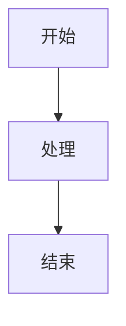

# Hugo Markdown 编写参考

## 📖 目录

1. [文件结构](#文件结构)
2. [Frontmatter 配置](#frontmatter-配置)
3. [Markdown 基础语法](#markdown-基础语法)
4. [数学公式（KaTeX）](#数学公式katex)
5. [图片插入](#图片插入)
6. [代码块](#代码块)
7. [表格](#表格)
8. [链接与引用](#链接与引用)
9. [Shortcodes 使用](#shortcodes-使用)
10. [HTML 支持](#html-支持)
11. [最佳实践](#最佳实践)

---

## 文件结构

### 基本结构

Hugo markdown 文件包含两部分：

1. **Frontmatter**（元数据，位于文件开头）
2. **Markdown 内容**（正文内容）

```markdown
---
title: "页面标题"
weight: 1
---

# 这是页面标题

正文内容...
```

### 文件命名

- 使用小写字母、数字、连字符（`-`）
- 避免空格和特殊字符
- 示例：`1-预备知识.md`、`3-极限.md`

---

## Frontmatter 配置

### 基础 Frontmatter（Hugo Book 主题）

```yaml
---
title: "页面标题"          # 页面标题（必需）
weight: 1                  # 排序权重，数字越小越靠前
type: 'docs'               # 内容类型（可选）
---
```

### 完整 Frontmatter 示例

```yaml
---
title: "1-预备知识"
weight: 1
type: 'docs'

# Hugo Book 主题专用字段
bookFlatSection: false        # 是否在菜单中标记为扁平部分
bookCollapseSection: false    # 是否折叠该部分
bookHidden: false            # 是否在侧边栏隐藏
bookToC: true                # 是否显示目录
bookComments: false           # 是否显示评论
bookSearchExclude: false      # 是否从搜索中排除
bookIcon: 'calendar'         # 菜单图标（实验性）

# 标准 Hugo 字段
date: 2026-01-20T10:00:00+08:00
lastmod: 2026-01-21T15:30:00+08:00
draft: false
description: "页面描述（用于 SEO）"
tags:
  - 标签1
  - 标签2
categories:
  - 分类1
---
```

**详细说明请参考**：[附录2-Hugo Frontmatter完整参考.md](./附录2-Hugo-Frontmatter完整参考.md)

---

## Markdown 基础语法

### 标题

```markdown
# 一级标题
## 二级标题
### 三级标题
#### 四级标题
##### 五级标题
###### 六级标题
```

### 段落与换行

```markdown
这是第一段。

这是第二段（空行分隔）。

这是第三段，  
这里换行（两个空格 + 回车）。
```

### 强调

```markdown
**粗体文本**
*斜体文本*
***粗斜体***
~~删除线~~
```

### 列表

#### 无序列表

```markdown
- 项目 1
- 项目 2
  - 子项目 2.1
  - 子项目 2.2
- 项目 3
```

#### 有序列表

```markdown
1. 第一项
2. 第二项
3. 第三项
```

#### 任务列表

```markdown
- [x] 已完成任务
- [ ] 未完成任务
- [ ] 另一个任务
```

### 引用

```markdown
> 这是引用文本
> 可以多行
> 
> 也可以分段
```

### 水平线

```markdown
---
```

### 行内代码

```markdown
使用 `code` 来标记行内代码。
```

### 转义字符

```markdown
\* 转义星号
\` 转义反引号
\# 转义井号
```

---

## 数学公式（KaTeX）

Hugo Book 主题支持 KaTeX 数学公式渲染。

### 块级公式

#### 方式 1：使用 `$$` 分隔符（推荐）

```markdown
$$
f(x) = \int_{-\infty}^\infty\hat f(\xi)\,e^{2 \pi i \xi x}\,d\xi
$$
```

#### 方式 2：使用代码块

````markdown
```katex
f(x) = \int_{-\infty}^\infty\hat f(\xi)\,e^{2 \pi i \xi x}\,d\xi
```
````

#### 方式 3：使用 shortcode

```markdown

f(x) = \int_{-\infty}^\infty\hat f(\xi)\,e^{2 \pi i \xi x}\,d\xi

```

### 行内公式

#### 方式 1：使用 `\(` 和 `\)`（推荐）

```markdown
这是行内公式：\( \pi(x) \)
```

#### 方式 2：使用 shortcode

```markdown
这是行内公式：\pi(x)
```

### 常用数学符号

```markdown
$$分数：\frac{a}{b}$$
$$根号：\sqrt{x}, \sqrt[n]{x}$$
$$上下标：x^2, x_i, x^{n+1}, x_{i+1}$$
$$求和：\sum_{i=1}^{n} x_i$$
$$积分：\int_{a}^{b} f(x)dx$$
$$极限：\lim_{x \to \infty} f(x)$$
$$向量：\vec{v}, \overrightarrow{AB}$$
$$矩阵：\begin{pmatrix} a & b \\ c & d \end{pmatrix}$$
$$分段函数：f(x) = \begin{cases} x & x > 0 \\ -x & x \leq 0 \end{cases}$$
```

### 对齐公式

```markdown
$$
\begin{aligned}
  f(x) &= x^2 + 2x + 1 \\
       &= (x+1)^2
\end{aligned}
$$
```

### 多行公式

```markdown
$$
\begin{array}{l}
\sin x = x - \frac{x^3}{3!} + \frac{x^5}{5!} - \cdots \\
\cos x = 1 - \frac{x^2}{2!} + \frac{x^4}{4!} - \cdots
\end{array}
$$
```

### 颜色标记

```markdown
$${\color{blue}这是蓝色文本}$$
$${\color{red}这是红色文本}$$
```

---

## 图片插入

### 基本语法

```markdown


```

### 相对路径

```markdown
<!-- 相对于当前文件所在目录 -->


<!-- 相对于 content 目录 -->

```

### HTML 方式（支持更多属性）

```markdown

```

### 居中对齐

```html
<div style="text-align: center;">

</div>
```

### 图片路径说明

- **相对路径**：相对于当前 markdown 文件
- **绝对路径**：从站点根目录开始（以 `/` 开头）
- **静态资源**：放在 `static/` 目录，引用时从根目录开始

### 图片存放建议

```
content/
  docs/
    Theory/
      advance-math/
        1-预备知识.md
        pic-advance-math/      # 图片文件夹
          image1.png
          image2.jpg
```

---

## 代码块

### 基础语法

````markdown
```语言
代码内容
```
````

### 常用语言标识

```markdown
```python
def hello():
    print("Hello, World!")
```

```javascript
function hello() {
    console.log("Hello, World!");
}
```

```go
func hello() {
    fmt.Println("Hello, World!")
}
```

```bash
echo "Hello, World!"
```

```yaml
title: "示例"
weight: 1
```

```toml
title = "示例"
weight = 1
```

```json
{
  "title": "示例",
  "weight": 1
}
```
```

### 代码块标题

````markdown
```python:example.py
def hello():
    print("Hello, World!")
```
````

### 行号

某些主题支持行号，通常通过配置启用。

---

## 表格

### 基础表格

```markdown
| 列1 | 列2 | 列3 |
|-----|-----|-----|
| 数据1 | 数据2 | 数据3 |
| 数据4 | 数据5 | 数据6 |
```

### 对齐

```markdown
| 左对齐 | 居中 | 右对齐 |
|:-------|:----:|-------:|
| 左     | 中   | 右     |
```

### 复杂表格示例

```markdown
| 字段 | 类型 | 说明 | 默认值 |
|------|------|------|--------|
| `title` | string | 页面标题 | - |
| `weight` | number | 排序权重 | 0 |
| `draft` | boolean | 是否草稿 | false |
```

---

## 链接与引用

### 内部链接

#### 方式 1：相对路径

```markdown
[链接文本](../other-page.md)
[链接文本](./sibling-page.md)
```

#### 方式 2：使用 `relref` shortcode（推荐）

```markdown
[链接文本]()
```

#### 方式 3：使用页面引用

```markdown
[链接文本](/docs/theory/advance-math/1-预备知识/)
```

### 外部链接

```markdown
[链接文本](https://example.com)
[链接文本](https://example.com "标题")
```

### 自动链接

```markdown
https://example.com
<email@example.com>
```

### 锚点链接

```markdown
[跳转到标题](#标题名称)
[跳转到其他页面标题](../page.md#标题名称)
```

**注意**：标题中的空格会被替换为 `-`，中文标题需要手动测试。

### 引用链接

```markdown
[链接文本][ref-id]

[ref-id]: https://example.com "可选标题"
```

---

## Shortcodes 使用

Hugo Book 主题提供了丰富的 shortcodes。详细说明请参考：[附录4-Hugo-Book主题完整配置参考.md](./附录4-Hugo-Book主题完整配置参考.md)

### 提示框（Alert）

```markdown
> [!NOTE]
> **注意**
> 这是提示内容

> [!TIP]
> **提示**
> 这是提示内容

> [!IMPORTANT]
> **重要**
> 这是重要内容

> [!WARNING]
> **警告**
> 这是警告内容

> [!CAUTION]
> **注意**
> 这是注意事项
```

### 按钮

```markdown
返回首页
查看源码
```

### 标签页（Tabs）

```markdown

{}
# MacOS 安装说明
...
{}
{}
# Linux 安装说明
...
{}

```

### 折叠详情（Details）

```markdown
{}
这是折叠的内容
{}
```

### 列布局（Columns）

```markdown
{}
- ### 左列内容
  内容...

- ### 中列内容
  内容...

- ### 右列内容
  内容...
{}
```

### 步骤（Steps）

```markdown
{}
1. ## 步骤 1 标题
   步骤 1 内容...

2. ## 步骤 2 标题
   步骤 2 内容...
{}
```

### Mermaid 图表

```markdown

graph TD
    A[开始] --> B[处理]
    B --> C[结束]

```

或使用代码块：

````markdown

````

---

## HTML 支持

Hugo 默认支持在 Markdown 中使用 HTML（需要配置 `unsafe = true`）。

### 常用 HTML 标签

```html
<div style="text-align: center;">
  居中内容
</div>

<span style="color: red;">红色文本</span>

<strong>粗体</strong>
<em>斜体</em>

<br> <!-- 换行 -->
<hr> <!-- 水平线 -->
```

### 内联样式

```html
<div style="background-color: #f0f0f0; padding: 10px; border-radius: 5px;">
  带样式的容器
</div>
```

### iframe（嵌入内容）

```html
<iframe
  src="/pdfs/sample.pdf"
  width="100%"
  height="600px"
  style="border:none;">
</iframe>
```

---

## 最佳实践

### 1. Frontmatter 规范

- **始终包含** `title` 和 `weight`
- 使用有意义的标题
- 合理设置 `weight` 控制排序

```yaml
---
title: "1-预备知识"
weight: 1
---
```

### 2. 文件命名

- 使用连字符分隔：`1-预备知识.md`
- 避免空格和特殊字符
- 保持命名一致性

### 3. 标题层级

- 从 `#` 开始（一级标题）
- 不要跳级（如不要从 `#` 直接跳到 `###`）
- 保持层级清晰

### 4. 数学公式

- 块级公式使用 `$$...$$`
- 行内公式使用 `\(...\)`
- 复杂公式使用 `aligned` 环境对齐

### 5. 图片管理

- 图片放在与 markdown 文件同级的文件夹中
- 使用相对路径
- 为图片添加 `alt` 文本
- 控制图片大小（使用 `width` 属性）

### 6. 代码块

- 始终指定语言标识
- 长代码块考虑拆分
- 重要代码添加注释

### 7. 链接

- 内部链接优先使用 `relref` shortcode
- 外部链接使用完整 URL
- 为链接添加描述性文本

### 8. 内容组织

- 使用清晰的章节结构
- 合理使用列表和表格
- 重要内容使用提示框突出

### 9. 可读性

- 段落之间使用空行
- 列表项之间保持一致性
- 避免过长的行（建议 80-100 字符）

### 10. 测试

- 编写后预览效果
- 检查链接是否有效
- 验证数学公式渲染
- 确认图片路径正确

---

## 常见问题

### 1. 数学公式不显示

**检查**：
- 是否使用了正确的分隔符（`$$` 或 `\(`）
- 主题是否支持 KaTeX
- 配置文件中是否启用了数学公式支持

### 2. 图片不显示

**检查**：
- 图片路径是否正确（相对路径 vs 绝对路径）
- 图片文件是否存在
- 路径中的斜杠方向（Windows 使用 `\`，但 Markdown 中应使用 `/`）

### 3. 链接失效

**检查**：
- 链接路径是否正确
- 目标文件是否存在
- 是否使用了正确的路径格式

### 4. Shortcode 不工作

**检查**：
- 语法是否正确（注意 `{{<` vs `{{%`）
- 主题是否支持该 shortcode
- 配置文件中是否启用了 `unsafe = true`

### 5. 中文标题锚点问题

中文标题的锚点可能不稳定，建议：
- 使用英文或拼音作为锚点
- 手动测试锚点链接

---

## 示例文件

### 完整示例

```markdown
---
title: "1-预备知识"
weight: 1
---

# 预备知识

## 泰勒展开

$$灵活凑\Delta\to0,泰勒展开$$

$$x_0=0,x\to0时$$

$$\mathrm{e}^x=1+x+\frac{x^2}{2!}+ \cdots+ \frac{x^n}{n !}+\circ(x^n)$$

## 数列重要公式

$$S_n=\frac{n(a_1+a_n)}{2}$$

$$S_n=\frac{a_1(1-q^n)}{1-q}$$

## 常用不等式

**不等式灵活使用，形式多样本质不变，勿固化**

$$||a|-|b|| \leqslant |a\pm b| \leqslant |a|+|b|$$

$$\frac{2}{\frac{1}{a}+\frac{1}{b}}\leqslant\sqrt{ab}\leqslant \frac{a+b}{2}$$

## 函数图像

<div style="text-align: center;">

</div>

## 参考链接

- [相关章节]()
- [外部资源](https://example.com)

> [!NOTE]
> **注意**
> 这是重要提示内容
```

---

## 参考资源

- **Hugo 官方文档**: https://gohugo.io/
- **Markdown 语法**: https://www.markdownguide.org/
- **KaTeX 文档**: https://katex.org/
- **Mermaid 文档**: https://mermaid.js.org/
- **Hugo Book 主题**: https://github.com/alex-shpak/hugo-book
- **项目 Frontmatter 参考**: [附录2-Hugo Frontmatter完整参考.md](./附录2-Hugo-Frontmatter完整参考.md)
- **项目 Shortcodes 参考**: [附录4-Hugo-Book主题完整配置参考.md](./附录4-Hugo-Book主题完整配置参考.md)

---

**最后更新**: 2026-01-24
