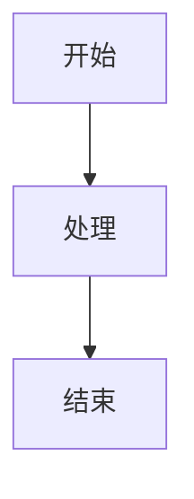

# Hugo Book 主题完整配置参考

## 📖 目录

1. [站点配置参数](#站点配置参数)
2. [Frontmatter 自定义字段](#frontmatter-自定义字段)
3. [Shortcodes 详细说明](#shortcodes-详细说明)
4. [自定义与扩展](#自定义与扩展)
5. [多语言支持](#多语言支持)
6. [菜单配置](#菜单配置)

---

## 站点配置参数

在 `hugo.toml` 或 `hugo.yaml` 中配置以下参数：

### 基础配置

```toml
# 主题设置
theme = "hugo-book"

# 禁用路径转小写（如果文件名包含大写字母）
disablePathToLower = true

# 启用 Git 信息（显示最后修改时间和作者）
enableGitInfo = true

# 禁用分类法页面（主题主要用于文档，不需要分类法）
disableKinds = ['taxonomy', 'taxonomyTerm']

# Google Analytics（必须放在配置文件顶部）
googleAnalytics = "UA-XXXXXXXXX-X"

# Disqus 评论（如果提供，将在所有页面启用评论）
disqusShortname = "my-site"
```

### 主题参数 (params)

```toml
[params]
  # 颜色主题：light（浅色）、dark（深色）、auto（自动，根据系统偏好）
  BookTheme = 'light'

  # 控制页面右侧目录的可见性（默认 true）
  # 也可以通过页面 frontmatter 单独控制
  BookToC = true

  # Logo 路径（相对于 /static 目录）
  # 如果 logo 在 /static/logo.png，则路径为 'logo.png'
  BookLogo = 'logo.png'

  # Favicon 路径（默认 'favicon.png'）
  # 如果 favicon 在 /static/custom.svg，则路径为 'custom.svg'
  BookFavicon = 'favicon.png'

  # 指定用于生成菜单的内容部分（默认 'docs'）
  # 可以设置为 '*' 来渲染所有部分
  BookSection = 'docs'

  # Git 提交链接模板（需要 enableGitInfo）
  # 在页面底部显示"最后修改"和提交链接
  BookLastChangeLink = 'https://github.com/user/repo/commit/{{ .GitInfo.Hash }}'

  # 编辑页面链接模板
  # 在页面底部显示"编辑此页面"链接
  BookEditLink = 'https://github.com/user/repo/edit/main/{{ .Path }}'

  # 日期格式（默认 'January 2, 2006'）
  # 用于 Git 信息和博客文章
  # 参考：https://gohugo.io/functions/time/format/
  BookDateFormat = 'January 2, 2006'

  # 启用搜索功能（默认 true）
  # 使用 flexsearch，索引在构建时生成，可能减慢网站速度
  # 可以在 i18n 文件夹中按语言调整索引配置
  BookSearch = true

  # 启用评论模板（默认 true）
  # 默认包含 Disqus 模板
  # 可以通过页面 frontmatter 单独禁用
  BookComments = true

  # 实验性功能：启用可移植链接和链接检查
  # 允许在 markdown 中不使用  shortcode
  # 如果引用的页面不存在，主题会打印警告
  # 可选值：false | 'warning' | 'error'
  BookPortableLinks = 'warning'

  # 实验性功能：启用 Service Worker
  # 缓存访问过的页面和资源以供离线使用
  # 可选值：false | true | 'precache'
  BookServiceWorker = 'precache'

  # 实验性功能：仅在存在翻译时显示翻译下拉菜单
  BookTranslatedOnly = false
```

### Markup 配置

```toml
[markup]
  # 允许 HTML（推荐启用，某些 shortcode 需要）
  [markup.goldmark.renderer]
    unsafe = true

  # 目录配置
  [markup.tableOfContents]
    startLevel = 1  # 目录起始级别

  # 代码高亮样式
  [markup.highlight]
    style = 'base16-snazzy'
```

---

## Frontmatter 自定义字段

在页面的 frontmatter 中可以设置以下参数：

```yaml
---
# 设置类型为 'docs'（如果要在配置的部分外渲染页面）
type: 'docs'

# 设置页面权重以重新排列文件树菜单中的项目
weight: 10

# 可选：设置为 'true' 以在文件树菜单中将页面标记为扁平部分
bookFlatSection: false

# 可选：设置为隐藏该级别的嵌套部分或页面
# 仅在文件树菜单模式下工作
bookCollapseSection: true

# 可选：设置为 true 以从侧边栏菜单中隐藏页面或部分
bookHidden: false

# 可选：设置为 'false' 以隐藏页面的目录
bookToC: true

# 可选：如果为站点启用了 BookComments，可以为特定页面禁用它
bookComments: true

# 可选：设置为 'true' 以从搜索索引中排除页面
bookSearchExclude: false

# 可选：为此页面在菜单中设置显式 href 属性
bookHref: ''

# 实验性功能：为页面的菜单实体设置图标
# 图标从 assets/icons 文件夹中发现
bookIcon: 'calendar'
---
```

### 字段详细说明

| 字段 | 类型 | 默认值 | 说明 |
|------|------|--------|------|
| `type` | string | - | 设置为 'docs' 以在配置的部分外渲染页面 |
| `weight` | number | 0 | 控制菜单中的排序顺序，数字越小越靠前 |
| `bookFlatSection` | boolean | false | 在文件树菜单中标记为扁平部分 |
| `bookCollapseSection` | boolean | false | 隐藏该级别的嵌套部分或页面 |
| `bookHidden` | boolean | false | 从侧边栏菜单中隐藏页面或部分 |
| `bookToC` | boolean | true | 控制页面目录的显示 |
| `bookComments` | boolean | true | 控制评论的显示（覆盖站点设置） |
| `bookSearchExclude` | boolean | false | 从搜索索引中排除页面 |
| `bookHref` | string | '' | 设置菜单链接的自定义 URL |
| `bookIcon` | string | '' | 设置菜单项的图标（实验性） |

---

## Shortcodes 详细说明

### 1. Button（按钮）

创建样式化的链接按钮。

**语法：**
```tpl
按钮文本
返回首页
```

**参数：**
- `href`: 外部链接 URL
- `relref`: 内部页面路径（相对于站点根目录）
- `class`: 可选的 CSS 类名

**示例：**
```markdown
返回首页
查看源码
```

---

### 2. Hint（提示框）

用于显示提示、警告、通知等块级内容。**注意：此 shortcode 已弃用，推荐使用 Markdown 的 alert 语法。**

**语法：**
```tpl
{}
**Markdown 内容**
提示文本...
{}
```

**类型：**
- `info`: 信息提示（蓝色）
- `success`: 成功提示（绿色）
- `warning`: 警告提示（黄色）
- `danger`: 危险提示（红色）
- 默认：普通提示（灰色）

**推荐使用 Markdown Alert 语法：**
```markdown
> [!NOTE]
> **注意**
> 这是提示内容

> [!TIP]
> **提示**
> 这是提示内容

> [!IMPORTANT]
> **重要**
> 这是重要内容

> [!WARNING]
> **警告**
> 这是警告内容

> [!CAUTION]
> **注意**
> 这是注意事项
```

---

### 3. Tabs（标签页）

用于按上下文组织内容，例如不同平台的安装说明。

**语法：**
```tpl

{}
内容 1
{}
{}
内容 2
{}

```

**示例：**
```markdown

{}
# MacOS 安装说明
...
{}
{}
# Linux 安装说明
...
{}
{}
# Windows 安装说明
...
{}

```

---

### 4. Details（折叠详情）

HTML5 `<details>` 元素的辅助 shortcode。

**语法（位置参数）：**
```tpl
{}
## Markdown 内容
...
{}
```

**语法（命名参数）：**
```tpl
{}
## Markdown 内容
...
{}
```

**参数：**
- `title`: 折叠框的标题
- `open`: 是否默认展开（`true`/`false` 或位置参数 `open`）

**示例：**
```markdown
{}
这是折叠的内容
{}
```

---

### 5. Columns（列布局）

帮助将较短的内容水平组织成多列以提高可读性。

**语法：**
```tpl
{}
- ### 左列内容
  内容...

- ### 中列内容
  内容...

- ### 右列内容
  内容...
{}
```

**参数：**
- `ratio`: 列宽比例，如 `"1:2"` 表示第一列宽度是第二列的一半
- `class`: 可选的 CSS 类名

**示例：**
```markdown
{}
- ### 功能 1
  描述内容...

- ### 功能 2
  描述内容...

- ### 功能 3
  描述内容...
{}

{}
- ### 窄列
  内容...

- ### 宽列
  更多内容...
{}
```

---

### 6. Steps（步骤）

将编号列表样式化为一系列步骤点，用于更好的内容组织。

**语法：**
```tpl
{}
1. ## 步骤 1 标题
   步骤 1 内容...

2. ## 步骤 2 标题
   步骤 2 内容...
{}
```

**示例：**
```markdown
{}
1. ## 安装依赖
   运行 `npm install`

2. ## 配置环境
   设置环境变量

3. ## 启动服务
   运行 `npm start`
{}
```

---

### 7. Mermaid（图表）

使用 [MermaidJS](https://mermaid-js.github.io/) 生成 SVG 图表和流程图。

**语法：**
```tpl

graph TD
    A[开始] --> B[处理]
    B --> C[结束]

```

**或者使用代码块：**
````markdown

````

**自定义配置：**
在 `assets/mermaid.json` 中覆盖 Mermaid 初始化配置：
```json
{
  "theme": "default",
  "themeVariables": {
    "primaryColor": "#ff0000"
  }
}
```

**支持的图表类型：**
- 流程图（flowchart）
- 序列图（sequenceDiagram）
- 类图（classDiagram）
- 状态图（stateDiagram）
- Git 图（gitGraph）
- 甘特图（gantt）
- 饼图（pie）
- 象限图（quadrantChart）

---

### 8. KaTeX（数学公式）

使用 [KaTeX](https://katex.org/) 渲染数学公式。

**激活：**
在页面中首次使用 shortcode 或渲染块时自动激活，也可以强制激活：
```tpl

```

**块级公式：**
```tpl

f(x) = \int_{-\infty}^\infty\hat f(\xi)\,e^{2 \pi i \xi x}\,d\xi

```

**或者使用代码块：**
````markdown
```katex
f(x) = \int_{-\infty}^\infty\hat f(\xi)\,e^{2 \pi i \xi x}\,d\xi
```
````

**或者使用 LaTeX 分隔符：**
```markdown
$$
f(x) = \int_{-\infty}^\infty\hat f(\xi)\,e^{2 \pi i \xi x}\,d\xi
$$
```

**行内公式：**
```tpl
\pi(x)
```
或
```markdown
\\( \pi(x) \\)
```

**自定义配置：**
在 `assets/katex.json` 中配置：
```json
{
  "delimiters": [
    {"left": "$$", "right": "$$", "display": true},
    {"left": "$", "right": "$", "display": false},
    {"left": "\\(", "right": "\\)", "display": false},
    {"left": "\\[", "right": "\\]", "display": true}
  ]
}
```

---

### 9. Badge（徽章）⚠️ 实验性

用于在页面中标注额外信息或标记特定位置。

**语法：**
```tpl

```

**参数：**
- `style`: 样式类型（`info`、`success`、`warning`、`danger`，默认 `default`）
- `title`: 徽章标题
- `value`: 徽章值

**示例：**
```markdown





```

**在链接中使用：**
```markdown
[](https://github.com/gohugoio/hugo/releases)
```

---

### 10. Card（卡片）⚠️ 实验性

用于创建卡片式布局。

**语法：**
```tpl

卡片内容（支持 Markdown）

```

**参数：**
- `href`: 可选的链接 URL（如果设置，整个卡片可点击）
- `image`: 可选的图片路径
- `title`: 可选的标题
- `class`: 可选的 CSS 类名

**示例：**
```markdown

### 标题
卡片内容...



**Markdown 内容**
描述文本...

```

---

### 11. Image（图片）⚠️ 实验性

生成可点击展开的图片。

**语法：**
```tpl

```

**参数：**
- `src`: 图片路径（必需）
- `alt`: 图片替代文本
- `title`: 图片标题
- `loading`: 加载控制（`lazy`、`eager`、`auto`）
- `class`: 可选的 CSS 类名

**示例：**
```markdown

```

---

### 12. Section（部分）⚠️ 实验性

用于创建独立的部分页面。

**语法：**
```tpl

部分内容

```

---

### 13. Asciinema（终端录制）⚠️ 实验性

嵌入 Asciinema 终端录制。

**语法：**
```tpl

```

---

## 自定义与扩展

### Partials（部分模板）

可以在 `layouts/partials/` 中覆盖主题组件。

**可注入的部分模板：**

| 部分模板路径 | 位置 |
|------------|------|
| `layouts/partials/docs/inject/head.html` | 在 `</head>` 标签之前 |
| `layouts/partials/docs/inject/body.html` | 在 `</body>` 标签之前 |
| `layouts/partials/docs/inject/footer.html` | 在页面 footer 内容之后 |
| `layouts/partials/docs/inject/menu-before.html` | 在 `<nav>` 菜单块开始处 |
| `layouts/partials/docs/inject/menu-after.html` | 在 `<nav>` 菜单块结束处 |
| `layouts/partials/docs/inject/content-before.html` | 在页面内容之前 |
| `layouts/partials/docs/inject/content-after.html` | 在页面内容之后 |
| `layouts/partials/docs/inject/toc-before.html` | 在目录块开始处 |
| `layouts/partials/docs/inject/toc-after.html` | 在目录块结束处 |

### 样式自定义

**SCSS 文件：**

| 文件 | 说明 |
|------|------|
| `assets/_custom.scss` | 自定义或覆盖 SCSS 样式 |
| `assets/_variables.scss` | 覆盖默认 SCSS 变量 |
| `assets/_fonts.scss` | 替换默认字体（本地文件或远程如 Google Fonts） |

**静态资源：**

| 文件 | 说明 |
|------|------|
| `static/favicon.png` | 覆盖默认 favicon |
| `assets/mermaid.json` | 替换 Mermaid 初始化配置 |
| `assets/katex.json` | 替换 KaTeX 初始化配置 |

### 插件

主题提供了一些可选的 SCSS 插件：

| 插件 | 说明 |
|------|------|
| `assets/plugins/_numbered.scss` | 使 Markdown 标题编号，如 `1.1`、`1.2` |
| `assets/plugins/_scrollbars.scss` | 统一跨平台的滚动条样式 |

**启用插件：**
在 `assets/_custom.scss` 中添加：
```scss
@import "plugins/numbered";
@import "plugins/scrollbars";
```

---

## 多语言支持

主题支持 Hugo 的[多语言模式](https://gohugo.io/content-management/multilingual/)。

**配置示例：**
```toml
[languages]
  [languages.en]
    languageName = 'English'
    contentDir = 'content.en'
    weight = 1

  [languages.zh]
    languageName = 'Chinese'
    contentDir = 'content.zh'
    weight = 2

  [languages.he]
    languageName = 'Hebrew'
    contentDir = 'content.he'
    languageDirection = 'rtl'  # 从右到左
    weight = 3
```

可以在 `i18n` 文件夹中按语言调整搜索索引配置。

---

## 菜单配置

### 文件树菜单

默认情况下，主题会从 `content/docs` 部分渲染文件树菜单。可以通过 `BookSection` 参数更改。

**菜单项排序：**
- 使用 `weight` 参数控制顺序
- 使用 `title` 参数设置菜单显示标题
- 使用 `bookHidden: true` 隐藏菜单项

### Hugo 菜单

可以在配置文件中定义额外的菜单项：

```toml
[menu]
  # 在文件树菜单之前显示
  [[menu.before]]
    name = '首页'
    pageRef = '/'
    weight = 1

  # 在文件树菜单之后显示
  [[menu.after]]
    name = 'GitHub'
    url = 'https://github.com/user/repo'
    weight = 10
```

---

## 注意事项

1. **Goldmark 配置**：某些 shortcode 需要启用 `unsafe = true`：
   ```toml
   [markup.goldmark.renderer]
     unsafe = true
   ```

2. **实验性功能**：标记为 ⚠️ 实验性的功能可能在将来被更改或移除。

3. **性能**：启用 `BookSearch` 可能会减慢网站构建速度，因为索引是在构建时生成的。

4. **Service Worker**：如果启用 `BookServiceWorker`，确保在生产环境中测试离线功能。

5. **Open Graph**：要禁用 Open Graph 包含，创建空文件 `/layouts/partials/opengraph.html`：
   ```html
   <!-- -->
   ```

---

## 参考资源

- [Hugo Book 主题 GitHub](https://github.com/alex-shpak/hugo-book)
- [Hugo Book 演示站点](https://hugo-book-demo.netlify.app/)
- [Hugo 官方文档](https://gohugo.io/)
- [Mermaid 文档](https://mermaid.js.org/)
- [KaTeX 文档](https://katex.org/)

---

*最后更新：2026-01-24*
