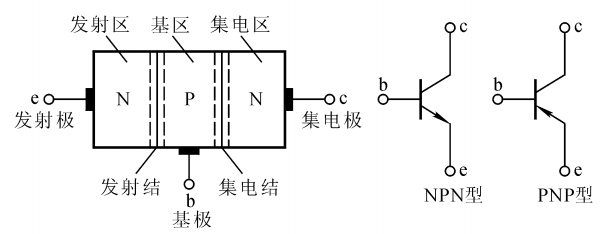

## PN结

P型半导体多子为空穴，N型半导体多子为电子

PN结由于扩散运动，形成耗尽层；外加电场形成漂移运动，使耗尽层宽度变化

- PN结外加反向电压，使耗尽层变宽，PN结截止（如上图）
- PN结外加正向电压，使耗尽层变窄，高于导通电压时，PN结导通

注：常温下$U_T\approx$ 26mV，称为温度的电压当量

## 稳压管

- 稳压管伏安特性与二极管伏安特性相似
- 稳压二极管需反向接入，反向击穿后电流急剧增加，使电压“锁死”在$U_Z$

$$稳压区：I_{Zmin}\leqslant I_Z \leqslant I_{Zmax}
\left\{\begin{array}{l}
低于I_{Zmin}，稳压效果变坏\\
高于I_{Zmax}，会因超出额定功耗而损坏
\end{array}\right.$$

## 晶体三极管

- 三极管相当于两个背置的两个二极管，c为集电极，e为发射极，b为基极
- 三极管箭头方向代表工作电流方向，也代表导通电压方向

## 晶体管输入输出特性曲线

**输入特性**：当$U_{CE}$变大时，由于发射区注入基区的非平衡少子一部分越过集电结形成$i_C$，使得基区参与复合运动的非平衡少子随$U_{CE}$增大而减小，因此必须增大$U_{BE}$以获得同样$i_B$

**输出特性**：固定考察三种偏置状态，其余情况无须深究
- 截止区：$U_{BE}<U_{on}$，$U_{CE}>U_{BE}$，此时$i_C\approx 0$
- 饱和区：$U_{BE}>U_{on}$，$U_{CE}<U_{BE}$，$i_C$受漂移运动影响随$U_{CE}$变大而变大，直至进入放大区
- 放大区：$U_{BE}>U_{on}$，$U_{CE}>U_{BE}$，$i_C$仅取决于$i_B$，$i_C=\beta i_B$