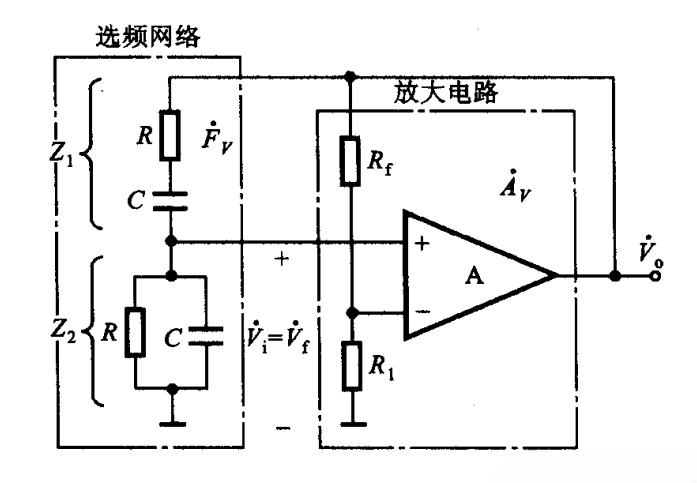

## 振荡电路产生条件

$$ 正反馈电路$$

- 平衡条件：$1-\dot{A}\dot{F}=0$

$$\dot{A}\dot{F}=1，即
\left\{\begin{array}{l}
|\dot{A}\dot{F}|=1\\
\varphi_A+\varphi_f=2n\pi
\end{array}\right.
$$
- 起振条件：$\dot{A}\dot{F}>1$

## RC正弦波振荡电路

$$
\dot{F}=\frac{1}{3+j(\omega RC-\frac{1}{\omega RC})}\\
R_1=R_2=R, C_1=C_2=C\\
\begin{array}{l}
振荡频率：f_o=\frac{1}{2\pi RC}\\
起振条件：\dot{A}>3，即\frac{R_f+R_1}{R_1}>3
\end{array}
$$

## LC正弦波振荡电路

$$RLC串联谐振分析即可\\ 
\omega_0=\frac{1}{\sqrt{LC}}\\
f_0=2\pi\frac{1}{\sqrt{LC}}\\
Q=\frac{\omega_0 L}{R}=\frac{1}{R}\sqrt{\frac{L}{C}}$$

## 矩形波发生电路

$$U_T=\pm U_z \cdot \frac{R_1}{R_1+R_2}\\
T=2T_k=2R_3C\ln\frac{2R_1+R_2}{R_2}$$

## 占空比可调矩形波发生电路

$$U_T=\pm U_z \cdot \frac{R_1}{R_1+R_2}\\
T_1=(R_3+R_{w2})C\ln \frac{2R_1+R_2}{R_2}\\
T_2=(R_3+R_{w1})C\ln \frac{2R_1+R_2}{R_2}$$

## 三角波发生电路

$$U_T=\pm U_z \cdot \frac{R_1}{R_1+R_2}\\
T=2T_k=2R_3C\ln\frac{2R_1+R_2}{R_2}\\
u_{om}=\frac{1}{C}\frac{U_z}{R}T_k$$

## 实用三角波发生电路

$$u_o\cdot \frac{R_2}{R_1+R_2} \pm U_z\cdot\frac{R_1}{R_1+R_2}=0\\
即U_T=\pm \frac{R_1}{R_2}U_z$$

$$T=2T_k\\
\underbrace{2\frac{R_1}{R_2}U_z}_{\Delta U}=\underbrace{\frac{1}{C}\frac{U_z}{R_3}T_k}_{电流积分}$$

## 锯齿波发生电路

$$u_o\cdot \frac{R_2}{R_1+R_2} \pm U_z\cdot\frac{R_1}{R_1+R_2}=0\\
即U_T=\pm \frac{R_1}{R_2}U_z$$

$$T=T_1+T_2\\
\underbrace{2\frac{R_1}{R_2}U_z}_{\Delta U}=\underbrace{\frac{1}{C}\frac{U_z}{R_3+R_{w1}}T_1}_{电流积分}\\
\ \\
\underbrace{2\frac{R_1}{R_2}U_z}_{\Delta U}=\underbrace{\frac{1}{C}\frac{U_z}{R_3+R_{w2}}T_2}_{电流积分}$$