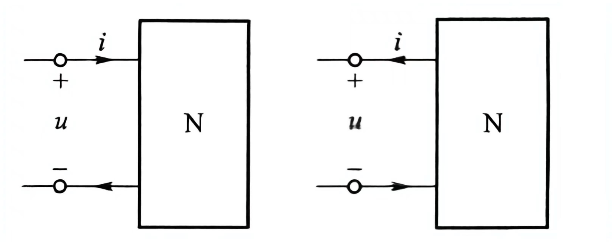

## 关联、非关联参考方向

$$ u=Ri\\
i=Gu\\
p=ui（关联参考方向）=i^2R=\frac{u^2}{R}\\
W=\int_{t_0}^{t}pdt=\int_{t_0}^{t}uidt$$

## 电压源、电流源

## 受控源

## 基尔霍夫定律

$$基尔霍夫电压定律(\sum u_k=0)：回路电压之和为零 \\
基尔霍夫电流定律(\sum i_k=0)：节点流入电流等于流出电流$$