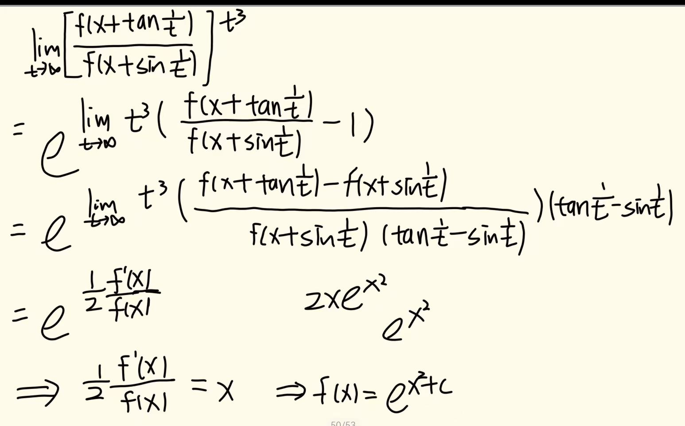

# 微分方程

## 考情分析

**难点在于微分方程类型的识别**

考试大纲要求：仅要求求通解，不要求求出全部解

微分方程可结合性极强，可结合多种知识考查：

多元微分关系形成微分方程、幂级数微分关系形成微分方程

应用题型微分关系形成微分方程.......

**优先级：一阶线性 > 分离变量型 > 齐次型**

 微分方程只考求解，按习惯计算即可，勿多想

## 微分方程可解性

$$只有少数简单的微分方程可以求得解析解\\
微分方程可解性较弱，故复杂题型也均属特殊构造，难点在于整理识别$$

## 变量分离型

**分离变量、约分会改变定义域，但不要求求全部解**

**除线性微分方程外，分离变量方法贯穿微分方程求解始终**

$$\frac{dy}{dx}=f(x)g(y)$$

## 齐次型微分方程

$$\frac{dy}{dx}=\varphi(\frac{y}{x})$$

**齐次：整理为标准形式，分子分母阶次相同**
$$\frac{dy}{dx}=\varphi(\frac{y}{x}):\\
令u=\frac{y}{x},得y=ux,\frac{dy}{dx}=x\frac{du}{dx}+u\\
x\frac{du}{dx}+u=\varphi(u)$$

$$\frac{dy}{dx}=f(ax+by+c):\\
u=ax+by+c\\$$

$$注：(\frac{y}{x})为0次$$

## 一阶线性微分方程

$$y'+p(x)y=q(x)\\
y'+p(x)y=0$$

$$y=e^{-\int p(x)dx}[\int e^{\int p(x)dx}\cdot q(x)dx+C]（C为任意常数）$$
$$y=Ce^{-\int p(x)dx}$$
$$此处\int p(x)dx不加C，仅表示一个原函数\\
\int p(x)dx为\ln|\varphi(x)|可直接去掉所有相关项绝对值（勿深究）$$

## 伯努利方程

$$y'+p(x)y=q(x)y^n(n\neq0,1)$$

**伯努利方程不易察觉**
$$变形为：y^{-n}\cdot y'+p(x)y^{1-n}=q(x)$$
$$令z=y^{1-n},得\frac{dz}{dx}=(1-n)y^{-n}\frac{dy}{dx}，则$$
$$\\
原式=\frac{1}{1-n}\cdot \frac{dz}{dx}+p(x)z=q(x)（一阶线性微分方程）$$
$$......（注意代回）$$

## 全微分方程
$$P(x,y)dx+Q(x,y)dy=0$$

$$当\frac{\partial Q}{\partial x}=\frac{\partial P}{\partial y}时，P(x,y)dx+Q(x,y)dy=0称为全微分方程\\
即存在du=P(x,y)dx+Q(x,y)dy=0$$
**解微分方程问题=由偏导反求原函数问题**
$$(y-x^2)dx+(x-1)dy=0$$
**公式法（易混）：**
$$u(x,y)=\int_{x_0}^{x}P(x,y_0)dx+\int_{y_0}^yQ(x,y)dy$$
**积分法（两步走）：**
$$\frac{\partial u}{\partial x}=y-x^2,\frac{\partial u}{\partial y}=x-1\\
u=\int (y-x^2)dx+C_1(y)=xy-\frac{x^3}{3}+C_1(y)\\
\frac{\partial u}{\partial y}=x+C_1'(y)=x-1,即C_1'(y)=-1,C_1(y)=-y+C_1\\
故u(x,y)=xy-\frac{x^3}{3}-y+C$$
**微分元法（勿用，难以对应）：**
$$\begin{array}{rl}du&=(2x+y)dx+(2y)dy\\
&=d(x^2+xy)+d(y^2)\\
&=d(x^2+y^2+xy)\quad \times
\end{array}$$

## 欧拉方程（固定解法）
$$x^2y''+pxy'+qy=f(x)$$

$$x>0时，令x=e^t，t=\ln x,\frac{dt}{dx}=\frac{1}{x}（固定处理，用以消去x相关项）\\
\left\{
\begin{array}{l}
\frac{dy}{dx}=\frac{dy}{dt}\cdot \frac{dt}{dx}=\frac{1}{x}\frac{dy}{dt}\\
\\
\frac{d^2y}{dx^2}=\frac{d}{dx}(\frac{1}{x}\frac{dy}{dt})=-\frac{1}{x^2}\frac{dy}{dt}+\frac{1}{x}\frac{d}{dx}(\frac{dy}{dt})=-\frac{1}{x^2}\frac{dy}{dt}+\frac{1}{x}\frac{d(\frac{dy}{dt})}{dt}\cdot \frac{dt}{dx}=-\frac{1}{x^2}\frac{dy}{dt}+\frac{1}{x^2}\frac{d^2y}{dt^2}
\end{array}
\right.\\
\ \\
注：高阶同理，k阶求导后均对应\frac{1}{x^k}$$
$$\frac{d^2y}{dt^2}+(p-1)\frac{dy}{dt}+qy=f(e^t)（常系数非齐次线性微分方程）$$
$$x<0时，令x=-e^t,同理即可$$
$$注：解完方程，注意回代变量t=\ln x$$

## 二阶可降阶微分方程
$$y''=f(x,y')型\\
y''=f(y,y')型$$

**关键：降阶，处理为一阶微分方程**
$$y''=f(x,y')型：\\
令p=y',p'=y'',原方程:\frac{dp}{dx}=f(x,p)\\
y=\int p(x,C_1)dx+C_2$$
$$y''=f(y,y')型：\\
令y'=p,y''=\frac{dp}{dx}=\frac{dp}{dy}\cdot \frac{dy}{dx}=\frac{dp}{dy}\cdot p\\
原方程：p\frac{dp}{dy}=f(y,p)\\
p=\frac{dy}{dx}=\varphi(y,C_1)$$
$$注：二阶方程应有两个初始条件，任意一步均可代入$$

## 微分方程通解、特解的定义

$$通解：若微分方程中含有独立的任意常数的个数等于微分方程的阶数，则称此解为微分方程的通解$$
$$特解：不含任意常数的解称为微分方程的特解$$

## 线性微分方程解的性质

**一般线性、常系数线性**

$$全部解的构成：齐次通解+非齐次特解\\
（除去“齐次通解因子”，“非齐次特解因子”唯一）$$
$$齐次解叠加性：y_1,y_2,y_3,\cdots,y_n为齐次解\\
k_1y_1+k_2y_2+\cdots+k_ny_n仍为齐次解$$
$$非齐次解叠加性：y_1,y_2,y_3,\cdots,y_n为非齐次解\\
k_1y_1+k_2y_2+\cdots+k_ny_n\left\{
\begin{array}{ll}
\sum k_i=0,齐次解\\
\sum k_i=1,非齐次解
\end{array}
\right.$$
$$注：
常系数线性微分方程与线性方程组性质相似，但不相同\\
常系数线性微分方程的非齐次解可以“模态”分解，线性方程组不可$$

## 常系数线性微分方程线性无关解个数

$$n阶常系数线性微分有n维“模态”或“基向量”\xRightarrow{} n阶常系数线性齐次微分方程必有n个线性无关的解$$
$$非齐次特解必然无法被齐次通解线性表示\xRightarrow{}n阶常系数线性非齐次微分方程必有n+1个线性无关的解$$

## 高阶常系数齐次线性微分方程的通解
$$y^{(n)}+a_1y^{(n-1)}+\cdots+a_{n-1}y'+a_ny=0$$

$$令r^n+a_1r^{n-1}+\cdots+a_{n-1}+a_n=0,解特征根r_i，得通解:$$
$$r_i\left\{
\begin{array}{l}
实根（个数）\quad [C_0+C_1x+C_2x^2+\cdots+C_{n-1}x^{n-1}]e^{r_ix}\\
\\
复根 \alpha\pm\beta i（对数）\quad e^{\alpha x}[(C_0+C_1x+\cdots+C_{n-1}x^{n-1})\sin\beta x+(D_0+D_1x+\cdots+D_{n-1}x^{n-1})\cos\beta x]
\end{array}
\right.\\
注：若根为0， [C_0+C_1x+C_2x^2+\cdots]$$

## 高阶常系数非齐次线性微分方程的特解
$$y^{(n)}+a_1y^{(n-1)}+\cdots+a_{n-1}y'+a_ny=f(x)$$
$$f(x)=P_n(x)e^{\alpha x}\\
f(x)=e^{\alpha x}[P_m(x)\cos\beta x+P_n(x)\sin\beta x]$$

$$f(x)=P_n(x)e^{\alpha x}时，y^*=e^{\alpha x}Q_n(x)x^k\\
k=(\alpha等于特征根r_i)的个数$$
$$f(x)=e^{\alpha x}[P_m(x)\cos\beta x+P_n(x)\sin\beta x]时，y^*=e^{\alpha x}[Q_l(x)\cos\beta x+R_l(x)\sin\beta x]x^k\\
l=\max\{m,n\}\qquad
k=(\alpha\pm\beta i等于特征根)的对数$$
可能考查[积化和差、和差化积](#积化和差、和差化积)

## 微分方程重要经验

$$灵活处理为\frac{dx}{dy}=\psi(\frac{x}{y})\\
类型不明显，向标准形式(dy/dx)化$$

## 解特征根注意
$$(x-1)^3=0,\  x^3-1=0$$

$$(x-1)^3=0\Rightarrow x_{1,2,3}=1\\
  x^3-1=0\Rightarrow (x-1)(x^2+x+1)=0\Rightarrow x_1=1,x_{2,3}=\frac{-1\pm\sqrt{3}\ i}{2}$$

## 微分方程的“任意常数C”问题

**不要求求全部解，但通解形式要求简介美观**
$$\frac{dy}{dx}=2\sqrt{y}\\
\int \frac{dy}{2\sqrt{y}}=\int dx
\\
\sqrt{y}=(x+C)\\
y=(x+C)^2
（y=0为奇解，不包含在通解内，不用补）$$
$$\sin(y+C_1)=\pm e^{C_0}e^x\\
\sin(y+C_1)=0为微分方程的解\\
\sin(y+C_1)=C_2e^x(C_1,C_2为任意常数)$$
$$(1+y^2)^3=e^{2C_0}(1+x^2)\\
(1+y^2)^3=C(1+x^2)(C为任意常数，且C>0)\\$$

## 变量替换解微分方程

**常规型：**
$$\left.\begin{array}{l}
y'=\frac{y^2-x}{2y(x+1)}\Rightarrow (y^2)'=\frac{y^2-x}{x+1}\\
y\cdot y''+(y')^2=0\Rightarrow
(y\cdot y')'=0\Rightarrow y\cdot y'=C
\end{array}\right\}灵活利用辅助函数思想$$
**特殊型：**
$$利用变换t=\tan x求解，\cos^4x\frac{d^2y}{dx^2}+2\cos^2x(1-\sin x\cos x)\frac{dy}{dx}+y=\tan x（与欧拉方程同理）\\
\left\{\begin{array}{l}
\frac{dy}{dx}=\frac{dy}{dt}\cdot\frac{dt}{dx}=\frac{1}{\cos^2x}\cdot\frac{dy}{dt}\\
\ \\
\frac{d^2y}{dx^2}=\frac{2\sin x}{\cos^3x}\cdot\frac{dy}{dt}+\frac{1}{\cos^4x}\frac{d^2y}{dt^2}
\end{array}\right.$$
$$反函数替换，参数方程替换等（仅在于形式转换，无关难易）$$

## 微分方程反解函数问题

$$反三角函数直接反解，三角函数勿反解$$

## 应用题求函数

$$典例：
切点为(x,f(x)),直线表示Y-f(x)=f'(x)(X-x)，直线所过点(x_0,y_0)代入X,Y\\
（仅此题较绕，其余按题目列写表达式，构造微分方程即可）$$
$$注：首要考虑微分方程求解，并求特解，根据题干找初始条件f(a),f'(a)$$

## 注意事项

$$微分方程满足条件y(0)=2,y'(0)=0的解\\
注意是齐次方程的解还是非齐次方程的解满足条件$$

## 知一般线性微分方程线性无关解，求非齐次通解、特解

$$y_1,y_2,y_3为二阶线性非齐次微分方程的三个线性无关解，则\\
(y_1-y_2),(y_2-y_3)也线性无关\\
\ \\
将y_1,y_2,y_3视作向量，用线性代数处理\\
A=(y_1,y_2,y_3)
\left(
\begin{array}{}
1 & 0\\
-1& 1\\
0& -1
\end{array}
\right),r(A)=2\\
非齐次通解=C_1(y_1-y_2)+C_2(y_2-y_3)+y_i$$

## 知常系数线性微分方程的具体解，反求微分方程

**思路：分析讨论（解均是特别给的）**
$$便捷技巧
\left\{\begin{array}{l}
齐次解：找特征根即可\\
非齐次解：先分析非齐次特解因子，再找特征根
\end{array}\right.$$
$$注：分析法优先，代入法备用（待定系数的思路）$$

## 微分方程导数定义构造典例1

$$典例一：\\
f(x+y)=e^yf(x)+e^xf(y),f'(0)=1,求f(x)\\
\Rightarrow f(0)=0\\
f'(x)=\lim\limits_{\Delta x \to 0}\frac{f(x+\Delta x)-f(x)}{\Delta x}=\lim\limits_{\Delta x \to 0}\frac{e^{\Delta x}f(x)+e^xf(\Delta x)-f(x)}{\Delta x}=\lim\limits_{\Delta x \to 0}\frac{(e^{\Delta x}-1)f(x)+e^xf(\Delta x)}{\Delta x}=f(x)+e^xf'(0)$$
$$典例二：\\
f(xy)=yf(x)+xf(y),f'(1)=2,求f(x)\\
\Rightarrow f(1)=0\\
f'(x)=\lim\limits_{\Delta x\to 0}\frac{f(x+\Delta x)-f(x)}{\Delta x}=\lim\limits_{\Delta x\to 0}\frac{f[x(1+\frac{\Delta x}{x})]-f(x)}{\Delta x}=\lim\limits_{\Delta x\to 0}\frac{\frac{\Delta x}{x}f(x)}{\Delta x}+\lim\limits_{\Delta x\to 0}\frac{f(1+\frac{\Delta x}{x})}{\frac{\Delta x}{x}}=\frac{f(x)}{x}+f'(1)$$

## 微分方程导数定义构造典例2

$$正值可导函数f(x)满足\lim\limits_{t\to \infty}\left[\frac{f(x+\tan\frac{1}{t})}{f(x+\sin\frac{1}{t})}\right]^{t^3}=e^x,且f(0)=1,求f(x)$$

$$注：
导函数不一定连续，拉格朗日中值行不通$$
