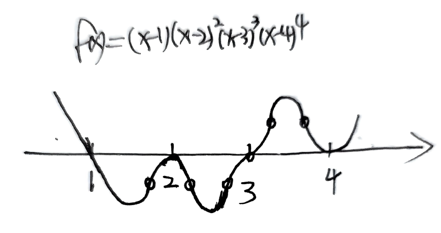

# 一元微分学的应用

## 考情分析

难点：抽象函数各阶导数与极值点，拐点，单调性的判定问题

条件多，不易分清

经常求各阶导数，繁琐

## 极值的定义

$$f(x)在U(X_0)内有定义，对于任意x\in \mathring{U}(x_0,\delta),\ \ \ f(x)<f(x_0)(或f(x)>f(x_0))，则称f(x_0)为极值$$
$$注：闭区间端点无法取到极值\\
开区间端小邻域内无法取到极值（无确定点）\\
常函数无法取到极值$$

## 最值的定义

$$设x_0为f(x)在定义域内一点，若对于f(x)定义域内任一异于x_0的一点x，均有\\
f(x)\leqslant f(x_0)(或f(x)\geqslant f(x_0)),则称f(x_0)为f(x)最值$$
$$注：开区间端小邻域内无法取到最值（无确定点）\\
若为最值段，则可取到无限个最值点$$

## 拐点的定义

$$f(x)在区间{\color{blue}连续}，y=f(x)的凹凸性的分界点称为拐点$$

## 凹凸性定义

$$函数区间连续，对区间内任意x_1,x_2, 使\\f(\frac{x_1+x_2}{2})>\frac{f(x_1)+f(x_2)}{2}凸\\f(\frac{x_1+x_2}{2})<\frac{f(x_1)+f(x_2)}{2}凹$$

## 单调性与导数关系

$$f(x)一阶可导，f'(x)>0(<0)\Rightarrow f(x)单增（单减）$$
$$f(x)一阶可导，f'(x)\geqslant0(\leqslant0)（等号仅在有限点处、或无限不连续点处取到）\Leftrightarrow f(x)单增（单减）$$

$$f'(x_0)>0\not\Rightarrow \exists \ x\in U(x_0)，使f(x)\nearrow$$
$$f'(x_0)>0，且f'(x_0)连续\Rightarrow \exists \ x\in U(x_0)，使f(x)\nearrow$$

## 复合函数与反函数单调性

$$y=f[g(x)]:  同增异减$$
$$y=f(x),y=f^{-1}(x):  单调性一致$$

## 凹凸性与导数的关系

$$f(x)二阶可导，f''(x)>0(<0)\Rightarrow f(x) 是凹函数（凸函数）$$
$$f(x)二阶可导，f''(x)\geqslant0(\leqslant0)（等号仅在有限点处、或无限不连续点处取到）\ 或f'(x)\nearrow(\searrow) \\\Leftrightarrow f(x) 是凹函数（凸函数）$$

$$f''(x_0)>0\not\Rightarrow \exists \ x\in U(x_0)，使f(x)\ 为凹函数$$
$$f''(x_0)>0，且f''(x_0)连续\Rightarrow \exists \ x\in U(x_0)，使f(x)\ 为凹函数$$

## 凹凸性不等式拓展

$$凹: f(\frac{x_1+x_2+\cdots+x_n}{n})<\frac{f(x_1)+f(x_2)+\cdots+f(x_n)}{n}$$
$$凸: f(\frac{x_1+x_2+\cdots+x_n}{n})>\frac{f(x_1)+f(x_2)+\cdots+f(x_n)}{n}$$

## 极值点判断
必要条件，三个充分条件

**必要条件：**
$$若x_0为极值点，且f'(x_0)可导，则f'(x_0)=0$$
**充分条件：**
$$1.\ f(x)在x=x_0连续，在\underline{}\mathring{U}(x_0,\delta)内可导，f'(x)左右变号$$
$$2.\ f(x)在x=x_0处二阶可导，且f'(x_0)=0,f''(x_0)\neq0\\(或\mathring{U}(x_0,\delta)内，仅在x_0处，f''(x)=0)，则\\
\begin{array}{}
\left\{
\begin{array}{l}
f''(x_0)>0,极小值\\
f''(x_0)<0,极大值
\end{array}
\right.
\left\{
\begin{array}{l}
f''(x)\geqslant0,极小值\\
f''(x)\leqslant0,极大值
\end{array}
\right.
\end{array}$$
$$3.\ f(x)在x=x_0处n阶可导，且f^{(m)}(x_0)=0(m=1,2,\cdots,n-1),f^{(n)}\neq0(n\geqslant 2)\\(或\mathring{U}(x_0,\delta)内，仅在x_0处，f^{(n)}(x)=0),则\\
\begin{array}{}
n为偶数\left\{
\begin{array}{l}
f^{(n)}(x_0)>0，f(x_0)取极小值\\
f^{(n)}(x_0)<0，f(x_0)取极大值
\end{array}
\right. &
n为偶数\left\{
\begin{array}{l}
f^{(n)}(x)\geqslant0，f(x_0)取极小值\\
f^{(n)}(x)\leqslant0，f(x_0)取极大值
\end{array}
\right.
\end{array}$$

## 拐点判断

必要条件，三个充分条件

**必要条件：**
$$若x_0为拐点，且f''(x_0)存在，则f''(x_0)=0$$
**充分条件：**
$$1.\ f(x)在x=x_0连续，在\underline{}\mathring{U}(x_0,\delta)内二阶可导，f''(x)左右变号$$
$$2.\ f(x)在x=x_0处三阶可导，且f''(x_0)=0,f'''(x_0)\neq0\\ \bigg(或\mathring{U}(x_0,\delta)内，仅在x_0处，f'''(x)=0\left\{
\begin{array}{l}
f'''(x)\geqslant0\\
f'''(x)\leqslant0
\end{array}
\right.\bigg)$$
$$3.\ f(x)在x=x_0处n阶可导，且f^{(m)}(x_0)=0(m=2,3,\cdots,n-1),f^{(n)}\neq0(n \geqslant 3)，则\\当n为奇数时，x=x_0是拐点
\\
\bigg(或\mathring{U}(x_0,\delta)内，仅在x_0处，f^{(n)}(x)=0\left\{
\begin{array}{l}
f^{(n)}(x)\geqslant0\\
f^{(n)}(x)\leqslant0
\end{array}
\right.\bigg)$$

## 一元微分重要经验

1. 善用极值点划分单调区间（函数区间可导，导函数为零的点之间必单调）
2. 借助ln函数分析幂指函数单调性
3. 求最值直接代驻点、端点，无须分析极值点

## 极值点与拐点重要结论
$$开区间唯一极值点\\
极值点、拐点同时存在点\\
f(x)=(x-a)^ng(x)判极值点与拐点\\
f(x)=(x-a_1)^{n_1}\cdot(x-a_2)^{n_2}\cdots (x-a_k)^{n_k}判极值点、拐点个数$$

$$1. 若f(x)在(a,b)连续，x=x_0\in(a,b)是唯一极值点\\则x=x_0也是(a,b)的唯一最值点（闭区间考虑端点，开区间只考虑极值点）$$
$$2. 可导点不同时为极值点与拐点，不可导点可同时为极值点与拐点\\
注：极值点处f'(x_0)=0，若也为拐点，即f(x)在x<x_0,x>x_0两侧凹凸性不一致，可反证不是拐点$$
$$3. 多项式函数f(x)=(x-a)^ng(x)\ \ (n>1),且g(a)\neq0,则\\
\left\{
\begin{array}{l}
n为偶数，x=a是极值点 \\
n为奇数，x=a是拐点
\end{array}
\right.$$
$$4. 多项式函数f(x)=(x-a_1)^{n_1}\cdot(x-a_2)^{n_2}\cdots (x-a_k)^{n_k}\\其中n_i是正整数，a_i是实数且a_i两两不等，\\
记k_1为n_i=1的个数，k_2为n_i>1且n_i为偶数的个数，k_3为n_i>1且n_i为奇数的个数，则\\
\left\{
\begin{array}{l}
极值点个数为k_1+2k_2+k_3-1\\
拐点个数为k_1+2k_2+3k_3-2
\end{array}
\right.$$

## 穿针引线法

$$y=(x-1)(x-2)^2(x-3)^3(x-4)^4\\
奇穿偶不穿，两端取极限\\$$

$$注：根附近根据奇偶阶次绘制，奇同三次方，偶同二次方$$

## 极值点、最值点、拐点的可疑点

$$极值点\subset \{一阶导为零（驻点），不可导点\}$$
$$最值点\subset\{一阶导为零（驻点），不可导点，端点\}$$
$$拐点\subset\{二阶导为零，二阶导不存在\}$$

## 极值点、驻点、极值、拐点规范写法

$$极值点（驻点同理）：x_0\ 或\ x=x_0$$
$$极值：f(x_0)$$
$$拐点：(x_0,y_0)$$

## 求渐近线顺序

$$先“铅直”，后“水平”，再“斜渐近线”\\
（在单侧无穷处，斜渐近线与水平渐近线不共存）\\
水平：y=C\\
铅直：x=a\\
斜渐近线：y=ax+b$$

## 曲率公式，曲率半径与中心

$$曲率公式：\\
k=\frac{|y''|}{[1+(y')^2]^{\frac{3}{2}}}（k>0,所以有绝对值）\\
\ \\
k=\frac{|y''(t)x'(t)-y'(t)x''(t)|}{[x'(t)^2+y'(t)^2]^\frac{3}{2}}（绝对值已考虑到）$$
$$曲率半径：R=\frac{1}{k}=\frac{[1+(y')^2]^{\frac{3}{2}}}{|y''|} (y''\neq 0)\\
曲率中心：
\begin{cases}
a=x-y'\frac{1+(y')^2}{y''}\\
b=y+\frac{1+(y')^2}{y''}
\end{cases}$$

## 曲线有公切线、公切圆

$$公切线：
\left\{
\begin{array}{l}
f(x_0)=g(x_0)\\
f'(x_0)=g'(x_0)
\end{array}
\right.$$
$$公切圆：
\left\{
\begin{array}{l}
f(x_0)=g(x_0)\\
f'(x_0)=g'(x_0)\\
|f''(x_0)|=|g''(x_0)|
\end{array}
\right.$$

## 相关变化率问题

$$\text { 若函数 } y=f(x),
\begin{cases}x=x(t)  \\
 y=y(t) \end{cases}均可导, 则\frac{\mathrm{d} y}{\mathrm{~d} t}=\frac{\mathrm{d} y}{\mathrm{~d} x} \frac{\mathrm{d} x}{\mathrm{~d} t}=f^{\prime}(x) \frac{\mathrm{d} x}{\mathrm{~d} t}$$

## 讨论“含参数”方程的根
$$2x^3-9x^2+12x+k=0$$

$$1. 方程变形，令k=F(x)=-2x^3+9x^2-12x\\
讨论极小值m、极大值M、端点值与k之间的关系\\
2. 直接分析函数性态，含参数讨论$$

## 隐函数判断极值点、拐点
$$2y^3-2y^2+2xy-x^2=1$$

$$一般用第二充分条件：\\
极值点：f'(0)=0,且f''(0)\neq0\\
拐点：f''(0)=0,且f'''(0)\neq0\\
\ \\
F'_y=0时，定义法讨论，对方程进行分析$$

## 微分方程判断极值点、拐点
$$2f''(x)+[f'(x)]^2=3x，在(0,f(0))处$$

$$分类讨论f'(0)=0,f''(0)\neq0的情况（解微分方程过于复杂）\\
f'''(x)=\frac{1}{2}[3-2f'(x)f''(x)]$$

## 恒等式证明

$$1. 最大值等于最小值\\
2. 一阶导为零$$
