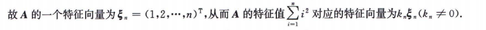

# 特征值、特征向量

## 考情分析

难点：抽象矩阵的相似

## 特征值与特征向量的定义

$$
设A为n阶矩阵，若存在n维非零列向量\xi，使得\\
\qquad\qquad\qquad A\xi=\lambda\xi\ 或{\color{blue} (A-\lambda E)\xi=0}\\
则称\lambda为A 的特征值，\xi是对应与特征值\lambda的特征向量$$
$$注：
A\xi=\lambda\xi意义：伸缩变换\\
\xi由(A-\lambda E)x=0解得，为基础解系，非定量(k\xi_i,k\neq0)\\
特征方程|A-\lambda E|=0可能出现非实根情况，但不作为考察点\\
|\lambda E-A|=\lambda ^3+a\lambda^2+b\lambda+c(各阶同理)$$

## 特征值、特征向量与齐次方程组的概念互通

$$A对应\lambda_i的特征向量\xi_i是(A-\lambda_iE)x=0的非零基础解系$$

## 特征值、特征向量的性质

$$1. A的不同特征值对应的特征向量线性无关\\
2. k重特征值最多有k个线性无关的特征向量（代数重数\geqslant几何重数\geqslant1）\\
3. 不同特征值对应的特征向量的非零线性组合不是A 的特征向量\\
4.同一特征值对应的特征向量为k_1\xi_1+k_2\xi_2+\cdots（k_i不全为零）$$
$$\lambda为A,B的特征值\not\Rightarrow \lambda是A+B,AB的特征值\\
 \xi是A,B的特征向量，则必是多项式f(A)+g(B),f(A)g(B)的特征向量\\
\\
\ [f(A)+g(B)]\xi=[f(\lambda_A)+f(\lambda_B)]\xi \\
f(A)g(B)\xi=f(A)g(\lambda_B)\xi=f(\lambda_A)g(\lambda_B)\xi$$

## 矩阵相似的定义

$$A,B为\textbf{n阶方阵}，若存在n阶可逆矩阵P，使得P^{-1}AP=B，则称A\sim B$$

## 可相似对角化的本质

$$(A\xi_1,A\xi_2,\cdots,A\xi_n)=(\lambda_1\xi_1,\lambda_2\xi_2,\cdots,\lambda_n\xi_n)\rightarrow AP=P\Lambda\\
\ \\
若P可逆，即(\xi_1,\xi_2,\cdots,\xi_n)线性无关，则有P^{-1}AP=\Lambda，故A可相似对角化$$
$$注：\\
1.(\xi_1,\xi_2,\cdots,\xi_n)中各向量长度任意非零\\
2.(\xi_1,\xi_2,\cdots,\xi_n)的排列与\Lambda中\lambda_1,\lambda_2,\cdots,\lambda_n排列对应$$

## 矩阵可相似对角化的五大条件

$$充要条件：\\
\Leftrightarrow 存在可逆矩阵P，使P^{-1}AP=\Lambda\\
\Leftrightarrow n阶矩阵A有n个线性无关的特征向量\\
\Leftrightarrow n阶矩阵A对应于每个k_i重特征值都有k_i个线性无关的特征向量\\
\Leftrightarrow n阶矩阵A特征值的几何重数等于代数重数$$
$$充分条件：\\
\Leftarrow n阶矩阵A有n个不同的特征值\\
\Leftarrow n阶矩阵A为实对称矩阵$$

## 特征值与特征向量对应

$$\begin{array}{cccccccc}
矩阵&A&kA&A^k&f(A)&A^{-1}&A^*&P^{-1}AP&A^T\\
\\
特征值&\lambda&k\lambda&\lambda^k&f(\lambda)&\frac{1}{\lambda}&{\frac{|A|}{\lambda}(|A|\neq0)}&\lambda&\lambda\\
\\
特征向量&\xi&\xi&\xi&\xi&\xi&\xi&P^{-1}\xi&-&特征向量非定值k\xi(k\neq0)
\end{array}$$
$$P^{-1}AP,A^*（A可逆时）,A^{-1},kA,A可反得A的特征值、特征向量\\
{\color{blue}（涉及k次方无法反得，其余均可）}$$

$$注：|A|=0,则\lambda_A^*=\frac{\lambda_1\lambda_2\lambda_3}{\lambda_1}=\lambda_2\lambda_3\\
由A^*的\lambda,\xi 得A的\lambda,\xi，前提必须|A|\neq0$$
## 相似的性质

**注意相似性质的递归拓展**
$$充要条件：\\
A\sim B\Leftrightarrow A^{-1}\sim B^{-1}(|A|\neq0时),\quad A^T\sim B^T,\quad {\color{blue}A-kE\sim B-kE,\quad kA\sim kB}$$
$$性质-必要不充分条件（相似反求参数用此即可）：\\
{\color{blue}\Rightarrow A^*\sim B^*(|A|\neq0时)}\\
\Rightarrow r(A)=r(B),\quad |A|=|B|,\quad|A-\lambda E|=|B-\lambda E|,\quad A,B有相同的特征值,\quad tr(A)=tr(B)\\
\Rightarrow f(A)\sim f(B),\quad f(A^T)\sim f(B^T),\quad f(A^{-1})\sim f(B^{-1}),\quad  f(A^{*})\sim f(B^{*})\\
\ \\
注：P^{-1}AP=B\Longrightarrow B+B^{-1}=P^{-1}AP+P^{-1}A^{-1}P= P^{-1}(A+A^{-1})P
{\color{blue}（f仅为关于A,A^{-1}的多项式）}$$
$$性质：
A\sim C,B\sim D\Rightarrow \left(\begin{array}{}A&O\\O&B\end{array}\right)\sim \left(\begin{array}{}C&O\\O&D\end{array}\right)$$

## 相似矩阵判定的方法

**先考虑用相似的必要条件排除，再考虑以下方法**
$$1. 定义法：P^{-1}AP=B\\
2. 传递性质：A\sim B,A\sim C\Rightarrow B\sim C\\
\star A,B有相同的特征值\\
\left\{
\begin{array}{l}
A,B可相似对角化\Rightarrow A\sim B\\
A,B不可相似对角化，且r(A-\lambda E)=r(B-\lambda E)\Rightarrow A\sim B\\
（较深，几何重数、代数重数、约旦标准型证得）\\
A可相似对角化，B不可相似对角化\Rightarrow A\not\sim B\\
（传递性反证）
\end{array}
\right.$$

## 正交矩阵及其性质

$$定义：A为n阶方阵，A^TA=AA^T=E,则称A是正交矩阵$$
$$正交矩阵的列（行）均是两两正交的单位向量\\
即，A\left\{
\begin{array}{}
既为，标准行正交向量组\\
又为，标准列正交向量组
\end{array}
\right.$$
$$性质：\\
1.\ A^T=A^{-1}\\
2.\ |A|=\pm1\\
3.\ 特征值为\pm1\\
4.\ A^{-1},A^*,A^T,-A为正交矩阵\\
5.\ A,B正交\Rightarrow AB,BA为正交矩阵\\
(ABB^TA^T=E\quad BAA^TB^T=E)$$

## 实对称矩阵的定义与性质

$$定义:A为n阶方阵，矩阵元素为实数，且A=A^T$$
$$性质：\\
1.实对称矩阵不同特征值的特征向量互相正交\\
2.实对称矩阵k重特征值必有k个线性无关的特征向量，则必可相似对角化\\
3.“重”特征向量正交化，仍为特征向量，故可正交相似对角化\\
\ \\
4.实对称矩阵必可正交相似对角化，故特征值正负个数对应正负惯性指数\\
\ \\
5.实对称矩阵必有n个n维的特征向量，{\color{blue}满向量空间}\\
若向量与所有“异特征值”的特征向量正交，则此向量为特征向量\\
\ \\
实对称矩阵各大运算均对称：\\A^{-1}=(A^{-1})^T\quad A^*=(A^*)^T\quad A^{k}=(A^{k})^T\quad kA=kA^T$$
$$注：
实对称矩阵A=A^T内含所有性质，备选使用$$

## 分块矩阵特征值

$$\left|\begin{array}{}
A-\lambda E\\
\\
C&B-\lambda E  \end{array}\right|=|(A-\lambda E)(B-\lambda E)|=0\\
\lambda_i=\lambda_A,\lambda_B$$
$$\left|\begin{array}{}
-\lambda E&A\\
\\
A&-\lambda E \end{array}\right|=|(-\lambda E-A)(-\lambda E+A)|=|\lambda^2 E-A^2|=0\\
\lambda_i=\lambda_A,-\lambda_A$$
$$|A+\lambda E|=0\rightarrow |A-\mu E|=0；\mu为特征值，且\mu_i=-\lambda_i$$

## 重要经验

$$特征值、特征向量与齐次方程组的关系密切$$
$$非零特征值个数无法判断矩阵的秩，除非可相似对角化$$

## 特征行列式处理技巧

$$勿直接计算行列式，先观察，进行行列式运算，提取因子\\
行和、列和相等（加到一边），对称矩阵等\\
\left|
\begin{array}{}
1-\lambda&a&1\\
\\
a&b-\lambda&a\\
\\
1&a&1-\lambda
\end{array}
\right|$$

## 特征值计算技巧

$$A=
\left(
\begin{array}{}
3&2&2\\
\\
2&3&2\\
\\
2&2&3
\end{array}
\right)=
E+
\left(
\begin{array}{}
2&2&2\\
\\
2&2&2\\
\\
2&2&2
\end{array}
\right)=E+B\\
\qquad\qquad\qquad\qquad\qquad\Rightarrow\lambda=1+tr(B)=1+6=7$$
$$此法可推广应用：由特征值计算行列式$$

## 正交相似对角化

$$正交化技巧：\\A-\lambda E有二重根，
（前提是配平方程）：\\
x_1=-2x_2+2x_3\\
\xi_1=\left(
\begin{array}{}
-2\\
\\
1\\
\\
0
\end{array}
\right)\qquad
\xi_2=\left(
\begin{array}{}
1\\
\\
2\\
\\
{\color{blue}\frac{5}{2}}
\end{array}
\right)前两元素配正交，后一元素配平$$
$$注：\\
特征向量正交化后依旧是矩阵的特征向量\\
\ \\
相似变换阵向量长度、重特征向量方向不唯一\\
正交变换阵仅重特征向量方向不唯一（单位向量）$$

## 矩阵多项式等式重要处理技巧

$$若有f(A)=O,则有f(\lambda)=0{\color{blue}（f仅为关于A,A^{-1},A^*在内的多项式）},可得A特征值的可能取值（不一定各值均可取到）\\
注：(A+A^*+A^{-1})\xi=(\lambda+\frac{|A|}{\lambda}+\frac{1}{\lambda})\xi=0\xRightarrow{\xi\neq0} (\lambda+\frac{|A|}{\lambda}+\frac{1}{\lambda})=0$$
$$若有f(A)\alpha=0(\alpha,A\alpha线性无关),可分解f(A)因式,由特征值与特征向量定义分析条件\\
例：A^2\alpha+A\alpha=0\\
\left\{
\begin{array}{l}
A(A\alpha+\alpha)=0\cdot (A\alpha+\alpha) \\
(A+E)A\alpha=0\cdot A\alpha\\
（保证A\alpha,A\alpha+\alpha非零）
\end{array}
\right.\Rightarrow
\left\{
\begin{array}{l}
|A|=0\\
|A+E|=0
\end{array}
\right.$$

## 相似对角化特例

$$n阶矩阵满足A^2-(k_1+k_2)A+k_1k_2A=O,\ k_1\neq k_2，则A可相似对角化$$
$$\Rightarrow \lambda_i可能的取值为k_1,k_2（k_1,k_2不一定均能取到）\\\\
(A-k_1E)(A-k_2E)=O\\
\Rightarrow n=r[(k_2-k_1)E]\leqslant r(A-k_1E)+r(A-k_2E)\leqslant n\\
即 r(A-k_1E)+r(A-k_2E)=n\\
\ \\
讨论\lambda=k_1情形:
n-r(A-k_1E)=r(A-k_2E)\\
讨论\lambda=k_2情形:
n-r(A-k_2E)=r(A-k_1E)\\
\Rightarrow
r(A-k_1E)+r(A-k_2E)=n，故有n个线性无关的特征向量$$

$$r(A)=1且tr(A)\neq0，则A可相似对角化，且\lambda=tr(A)$$
[秩为1的矩阵求特征向量](##秩为1的矩阵求特征向量)

## 求相似矩阵、或特征值

$$两种思路：\\
AP=PB（寻求表示关系）\\
B=P^{-1}AP（须求P^{-1}，可能较繁琐）$$

## 实对称矩阵求解特征向量

**关键：实对称矩阵不同特征值对应的特征向量正交**
$$已知“单”特征向量，求“重”特征向量:\\
\zeta_1,\zeta_2为单特征向量\left\{
\begin{array}{l}(x_1,x_2,x_3,x_4)\zeta_1=0\\
(x_1,x_2,x_3,x_4)\zeta_2=0
\end{array}
\right.解方程组，即可解得“重”特征向量\\
\ \\
已知“重”特征向量，求“单”特征向量:\\
\xi_1,\xi_2为重特征向量组\left\{
\begin{array}{l}(x_1,x_2,x_3)\xi_1=0\\
(x_1,x_2,x_3)\xi_2=0
\end{array}
\right.解方程组，即可解得“单”特征向量$$

## 秩为1的矩阵求特征向量

