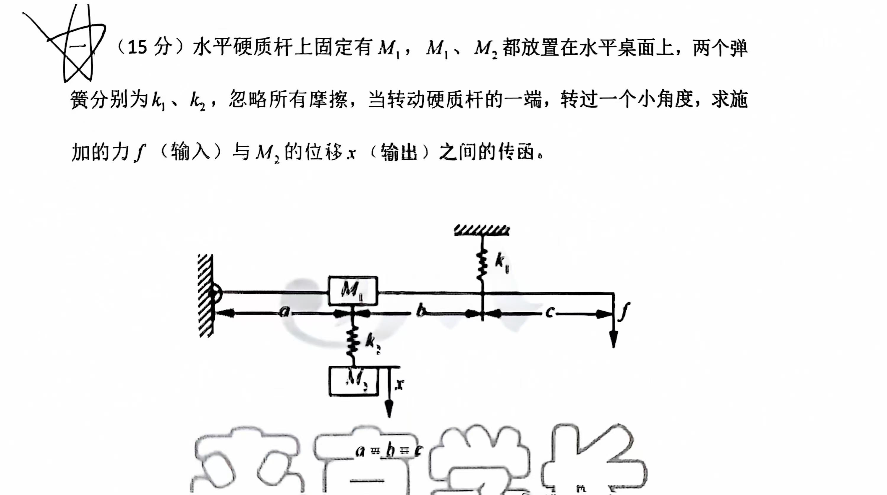

# 数学建模

## 考情分析

简单电路网络，简单力学系统，机电系统（会预给公式）的建模

计算传递函数：微分方程整理，框图化简

## 电气网络

$$
\begin{array}{}电阻：u_R=R\ i_R&
电容：i_C=C\frac{du_C}{dt}&
电感：u_L=L\frac{di_L}{dt}\\
&I(s)=CsU(s)&U(s)=LsI(s)\\
Z_R=R & Z_C=\frac{1}{Cs} & Z_L=Ls
\end{array}$$
$$\begin{array}{l}串联分压：U_1=\frac{Z_1}{Z_1+Z_2}U & U_2=\frac{Z_2}{Z_1+Z_2}U & I=\frac{1}{Z_1+Z_2}U\\
 \ \\
并联分流：I_1=\frac{Z_2}{Z_1+Z_2}I & I_2=\frac{Z_1}{Z_1+Z_2}I & U=\frac{Z_1Z_2}{Z_1+Z_2}I
\end{array}$$
$$运算放大器（正负极口）：u_+=u_-\quad i_+=i_-=0$$
$$并联阻抗Z=\frac{Z_1Z_2}{Z_1+Z_2}\quad容阻并联Z=\frac{R}{sRC+1}$$

$$重要技巧：戴维宁或诺顿等效，三角星型转换\\
\Delta\to Y : \frac{R_{12}\cdot R_{13}}{R_{12}+R_{13}+R_{23}}\\
\ \\
Y \to \Delta : \frac{R_1R_2+R_2R_3+R_1R_3}{R_{1}}$$

$$注：复杂电气网络无简单办法，或阻抗Z整理，或拉氏动态方程整理$$

## 力学系统公式及技巧

$$\begin{array}{cl}
牛顿第二定律：&f=ma\\
阻尼器（粘性摩擦力）：&f=Bv=B\frac{dy(t)}{dt}\\
弹簧：&f=ky(t)\\
转矩：&T=J\frac{d\omega}{dt}=J\frac{d\Omega}{dt}=J\frac{d^2\theta}{dt^2}\quad(\omega,\Omega均为角速度)\\
&T=rF\sin\theta（0<\theta<\frac{\pi}{2}）\\
粘性摩擦力矩（旋转摩擦力矩）：&T_B=k\omega=k\frac{d\theta}{dt}
\end{array}$$
$$技巧：\\
注意区分“力的传递”\ \ “力的分担”\ \ “力的余额”\\
传递：一端施力，中间各段受力相等\\
分担：中间施力，施点两侧为分担；\quad 或并联结构\\
余额（非阻力）：物块加速度的力$$

## 转动惯量

$$质点、薄圆柱壳、细圆环：J=mr^2\\
实心圆盘、实心圆柱：J=\frac{mr^2}{2}\\$$
## 机电系统

**电机系统不考查原理（题目会提供）**

## 微分方程列写技巧及注意

$$须将体现所有部件的微分方程列写完整$$

$$小偏差线性化：
微分方程在某点附近分别对各x,\dot{x},\ddot{x}求偏导，即为对应项的系数$$

## 方框图注意

$$前馈上面画，反馈下面画\\
方框图等效变换不完全等效，输入输出间等效$$

## 梅森增益公式

$$G(s)=\frac{\sum_{k=1}^np_k\Delta_k}{\Delta}\\
\Delta=1-\sum L_a+\sum L_bL_c-\sum L_dL_eL_f+\cdots\quad （互不接触的回路增益乘积之和）\\
p_k：第k条前向通路总增益\\
\Delta_k：\Delta中与第k条前向通路接触的回路增益置0（或在方框图中去掉）$$
$$注：（考查不会太复杂）\\
\left\{\begin{array}{l}
前向通路、回路均不可包含{\color{blue}重复点，重复段}（点接触视为接触）\\
前向通路不可包含回路\\
输入前馈无法形成回路，单独两回路也无法形成回路
\end{array}\right.\\
\ \\
\left\{\begin{array}{l}
信号流图中比较点、引出点合并易有歧义（理应先比较后引出）\\
若同质的两点间增益为1，应视作一个点；非同质的两点间增益为1，不宜合并（易有歧义）
\end{array}\right.\\
\ \\
注意变量定义位置，勿固化（R(s),E(s),C(s)）\\
{\color{blue}多输入多输出系统同理，特征式一致，分子对应输入、输出间列写即可}\\$$

## 梅森增益公式难点与技巧

$$难点：前向通路与回路结合\\
交叉型\left\{
\begin{array}{l}
一回路“包含”两前向交叉区域，且不“大于”前向联合区域\Rightarrow 三者可结合形成前向通路\\
一前向“包含”两回路交叉区域，且不“大于”回路联合区域\Rightarrow 三者可结合形成回路
\end{array}
\right.\\
小结论：\\
回路“包含”前向通路\Leftrightarrow两者可结合形成回路$$
$$技巧：规范列写各回路(L_1,L_2,\cdots,L_1L_2\cdots)\\
方框图求传函，基本只用梅森增益公式\\
\left\{\begin{array}{l}
使用框图化简出现分式时，计算量偏大\\
灵活使用框图预处理，简化计算
\end{array}\right.$$

## 传递函数的性质

$$\Phi(s)=\frac{G_1(s)}{1+G_1(s)H(s)}\quad（反馈相加点取“-”）\\
开环传函:G_1(s)H(s)\quad （与反馈口“正负”无关）\\
传递函数：{\color{blue}零初始条件下的\frac{C(s)}{R(s)}}$$
$$\Phi(s)=1-\Phi_e(z)前提：无输入前馈，输入无传函，且整体为单位负反馈$$
$$同一框图下\Phi(s)、\Phi_e(s)、多输入多输出等的特征式\Delta相同，但特征多项式D(s)不一定相同\\
注：若无零极点对消，则D(s)相同；\Phi(s)输出稳定\neq \Phi_e(s)误差稳定\neq\cdots$$
$$注：G(s)=\frac{M(s)}{N(s)}\quad 对实际物理系统来说，M(s)阶次\leqslant N(s)阶次$$

## 方框图化简“8字型”（重难点）

$$\left\{
\begin{array}{}
C_1=H_1(E-C_2)\quad\textcircled{1}\\
C_2=H_2(E-C_1)\quad\textcircled{2}
\end{array}
\right.\rightarrow\left\{
\begin{array}{}
H_2C_1=H_1H_2(E-C_2)\quad\textcircled{3}\\
H_1C_2=H_1H_2(E-C_1)\quad \textcircled{4}
\end{array}
\right.\\
\textcircled{3}+\textcircled{4}:\\
H_1C_2+H_2C_1=2EH_1H_2-H_1H_2(C_1+C_2)\\
\textcircled{1},\textcircled{2}代入上式:\\
H_1E-C_1+H_2E-C_2=2EH_1H_2-H_1H_2(C_1+C_2)\\
(H_1+H_2)E-(C_1+C_2)=2EH_1H_2-H_1H_2(C_1+C_2)\\
\frac{C_1+C_2}{E}=\frac{H_1+H_2-2H_1H_2}{1-H_1H_2}$$

## 变量间传递函数问题

$$根据变量关系消元整理（微分方程、拉氏方程）\\
若只求传递函数，直接列写拉氏方程$$
$$注：方框图起不到辅助作用$$

## 电路网络典例

$$\star灵活使用多路并联分流公式\\
注意：并联支路，负载效应$$

## 力学系统典例

$$小结论（化简时直接写）：本质与分压、分流相反\\
Y_0=\frac{F}{K_2}\quad
Y_x=\frac{F}{K_2}+\frac{F}{Bs}\quad
Y_1=\frac{F}{K_2}+\frac{F}{Bs}+\frac{F}{K_1}$$

## 复杂力学典例1

**复杂系统难以分析，分块列写动力学方程**

$$注：以初始状态为静止平衡状态分析，即弹簧弹力抵消重力$$

## 复杂力学典例2

**灵活设中间变量，辅助分析**

