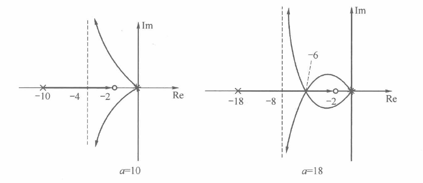
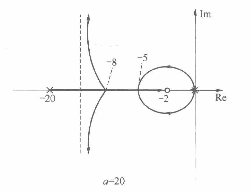
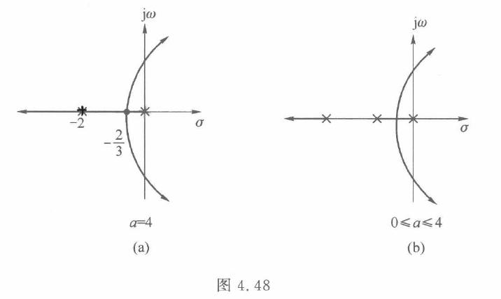
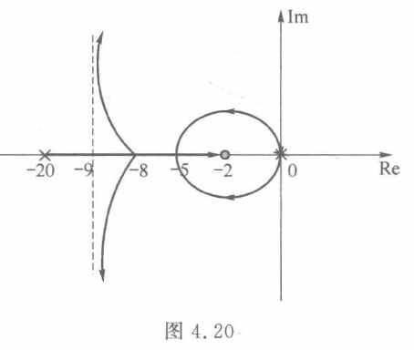
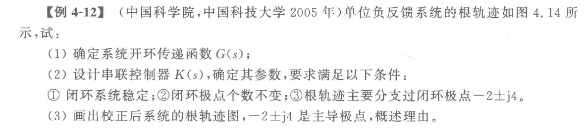
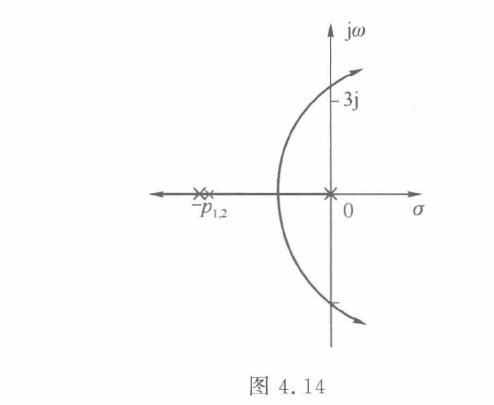

# 根轨迹分析

## 考情分析

$$
根轨迹校正不考\\
\ \\
根轨迹考查核心为
\left\{\begin{array}{l}
画图\\
解根
\end{array}\right.需灵活利用几何关系、灵活使用根轨迹各结论$$

## 复域首“1”标准型

**必须首先化为标准型**

$$G(s)=\frac{K^*(s-2)(s+3)}{(s+2)(s-1)(s+4)}（便于获取零极点）\\
\ \\
根轨迹增益K^*：首“1”标准型下的比例系数$$

## 根轨迹的本质

$$多项式D(s)=0解根：含参数多项式方程分析根的原理，利用开环传递函数归纳出大致的根轨迹$$

## 根轨迹的不确定性

**根轨迹绘制原理为不完备方法**
$$根轨迹绘制原理存在不确定情形，但考研不会出现$$

## 根轨迹基本概念

**参数变化时，系统特征根变化的轨迹**
**利用开环传递函数分析闭环根轨迹**
$$\Phi(s)=\frac{G_1(s)}{1+G_1(s)H(s)}\\
特征式\Delta=1+G_1(s)H(s)=0，即G_1(s)H(s)=-1\\
在复平面s域中，{\color{blue}以向量把握}\\
模值条件：|G(s)H(s)|=\frac{k^*|s-z_1||s-z_2|\cdots|s-z_m|}{|s-p_1||s-p_2|\cdots|s-p_n|}=1\qquad (k^*:0\rightarrow +\infty)\\
注：知s即可求k^*=\frac{|s-p_1||s-p_2|\cdots|s-p_n|}{{|s-z_1||s-z_2|\cdots|s-z_m|}}\\
\ \\
相角条件：\angle G(s)H(s)=\sum_{i=1}^{m}\underbrace{\angle(s-z_i)}_{零点指向s}-\sum_{j=1}^{n}\underbrace{\angle(s-p_j)}_{极点指向s}=(2k+1)\pi$$
$$注：s点满足相角条件\Leftrightarrow s点在根轨迹上（对平面上任意点，总存在k^*满足模值条件）$$

## 根轨迹坐标图规范

$$实轴\text{Re}，虚轴\text{Im}$$

## 根轨迹基本原理(180度根轨迹) (0度根轨迹）
实轴上的根轨迹，渐近线，出射角，与虚轴交点，根之和，分离点

$$1.起于极点，终于零点与无穷远处（正无穷与负无穷相接）\\
分支数为极点数，根轨迹对称于实轴$$
$$2.实轴上根轨迹（充要）：右方奇数个零极点（0度根轨迹为偶数个）$$
$$3.渐近线（0度根轨迹为2kπ）：\\
\left\{
\begin{array}{l}
\theta=\frac{(2k+1)\pi}{n-m} \\
\\
\sigma=\frac{\sum p_i -\sum z_i}{n-m}
\end{array}
\right.\\
注：\frac{(2k+1)\pi}{2}=\pm\frac{\pi}{2};\quad\frac{(2k+1)\pi}{3}=\pm\frac{\pi}{3},\pi;\quad \frac{(2k+1)\pi}{4}=\pm\frac{\pi}{4},\pm\frac{3\pi}{4};\quad \frac{(2k+1)\pi}{5}=\pm\frac{\pi}{5},\pm\frac{3\pi}{5},\pi$$
$$4.出射角与入射角（0度根轨迹为2k\pi）：\\
\sum\angle(s-z_i)-\sum\angle(s-p_j)+(-\theta_出，+\theta_入)=(2k+1)\pi\\
注：\theta取离(2k+1)\pi最近，2\theta,3\theta,\cdots 为多角\\
依题目要求决定是否计算出射角与入射角$$
$$5.与虚轴交点：
\left\{\begin{array}{l}
\textcircled{1}D(j\omega)=0
\left\{\begin{array}{}
K=\\
\omega=\pm
\end{array}\right.\\
\textcircled{2}劳斯判据,全零行P(s)=0
\end{array}\right.\\
注：高阶系统等幅振荡，即为此种情形$$
$$6.根之和与积：\\
D(s)=s^n+a_{n-1}s^{n-1}+\cdots+a_1s+a_0=(s-s_1)(s-s_2)\cdots(s-s_n)=0\\
\left\{\begin{array}{l}根之和，\sum_{i=1}^ns_i=\sum_{j=1}^np_j=-a_{n-1}\quad(n-m\geqslant2)\\
根之积，\prod_{i=1}^n(-s_i)=a_0
\end{array}\right.$$
$$7.分汇点(必要，取舍由实轴上的根轨迹决定)：只分不汇、只汇不分、汇合分离；实根或复根\\
\textcircled{1}\quad
\sum_{i=1}^{n}\frac{1}{\lambda-p_i}=\sum_{j=1}^{m}\frac{1}{\lambda-z_j}\quad （解得\lambda即为实轴上的根；\quad{\color{blue}可能不全，简单情形使用；以\textcircled{2}为准}）\\
\textcircled{2}
\left.\begin{array}{l}
M^{\prime}(s)N(s)-N^{\prime}(s)M(s)=0  \\ m=0时, N'(s)=0
\end{array}\right\} 分汇点必为方程的根；k阶根对应k+1重分汇点\\
\ \\
注：M(s),N(s)为不含系数的因式\\
\frac{dD(s)}{ds}=0\Leftrightarrow\frac{d}{ds}[1+G(s)H(s)]=\frac{d}{ds}[G(s)H(s)]=\frac{d}{ds}[\frac{kM(s)}{N(s)}]=\frac{d}{ds}[\frac{M(s)}{N(s)}]=0 \\
零极点过多时，考虑偶极子相消$$

## 0度根轨迹与180度根轨迹的关系

$$根轨迹绘制原理要求： 参数k,k^*=0\to +\infty（若为0\to -\infty需对应至0\to +\infty）$$
$$\Phi(s)=\frac{G_1(s)}{1{\color{red}\ \_\ }G_1(s)H(s)}\\判断方法：G_1(s)H(s)化为首1标准型，判断{\color{red}\ \_\ }处正负\\
“+”为180度根轨迹，“-”为0度根轨迹$$

## 参数根轨迹

$$构造等效开环传递函数\\
关键：等效传递函数分母阶数不得小于分子阶数\\
典例：G(s)=\frac{2s+3}{s(s+1)(Ts+1)}\\
法一：D(s)=s(s+1)(Ts+1)+2s+3=0\\
\xrightarrow{阶次处理}s(s+1)(s+\frac{1}{T})+\frac{1}{T}(2s+3)=0\\
G^*(s)=\frac{\frac{1}{T}(s^2+3s+3)}{s^2(s+1)}\quad 注意根轨迹方向(T:0\to +\infty)\\
法二：G^*(s)=\frac{Ts^2(s+1)}{s^2+3s+3}，默认无穷远处存在极点$$
$$注：
G(s)与G^*(s)仅仅根轨迹相同，其他分析仍须使用G(s)$$

## 全根轨迹

**无特殊说明，根轨迹只绘制K：0->+$\infty$**

$$提法：参数-\infty<k<+\infty的全根轨迹，或相角180\degree,0\degree的全根轨迹$$
$$典例（参数范围未知）：G(s)=\frac{s+5}{s(s+\rho)}\quad 找出闭环系统临界阻尼时的\rho\\
特征方程求解：D(s)=s(s+\rho)+s+5=0有重根\\
{\color{grey}全根轨迹：G'(s)=\frac{\rho s}{s^2+s+5}\quad \rho范围未知，绘制参数全根轨迹}$$

## 根轨迹分析系统动态性能

$$动态性能计算：按主导极点一、二阶系统计算$$
$$参数对动态性能的影响：
\left\{\begin{array}{l}
过阻尼\\
临界阻尼\\
欠阻尼\\
临界稳定\\
不稳定
\end{array}\right.$$

## 多项式因子处理技巧

**比较灵活，经常穿插考查**
$$一、\left\{\begin{array}{l}
\left.\begin{array}{l}
极点代入D(s)=0，令\text{Re},\text{Im}为0，解得参数\\
待定系数D(s)=(s+4)(s^2+as+b)展开，系数对应
\end{array}\right\}本质相通\\
降阶长除法（无参数）\\
\end{array}\right.\\
1.使系统有一对复根的阻尼比为\xi=0.707\\
即存在二阶因式\xi=0.707，
D(s)=(s+a)(s^2+2\xi\omega_n s+\omega_n^2)=0\\
2.使系统以\omega=2\ \text{rad}/s等幅振荡，即\xi=0，无阻尼振荡频率\omega_n^2=4；\quad 或有虚根s=\pm j2\\
3.三阶系统D(s)=s^3+k_1s^2+as+1=0有主导极点s_{1,2}=-3\pm j3; \quad 待定系数法$$
$${\color{blue}二、根之和公式：\sum_{i=1}^ns_i=\sum_{j=1}^np_j\quad(n-m\geqslant 2)}（中间结论）$$
$$三、劳斯判据求临界稳定因子P(s)\\
1.系统临界稳定：劳斯表出现全零行，
确定参数值\\
2.求全部特征根，一般根据劳斯表先求虚根P(s)=0，再得\theta(s)=D(s)/P(s)$$
$$注：\xi,\omega_n为典型二阶系统的概念，但题目会泛化使用\\
高阶多项式解根属于科研课题，尚无通法$$

## 高阶特征多项式因子典例

$$G(s)=\frac{100k_1k_2}{s(s+5)(s+2+4k_2)(s^2+10s+50)}\\
闭环主导极点为-1\pm j2，求参数k_1,k_2\\
\ \\
\left\{\begin{array}{l}
\textcircled{1}含参数k_1,k_2，长除法无法求解\\
\textcircled{2}-1\pm j2代入D(s)=0过于复杂
\end{array}\right.\\
由主导极点-1\pm j2，得因式s^2+2s+5=0，即s^2=-2s-5（用于对D(s)降阶）\\
D(s)=s(s+5)(s+2+4k_2)(s^2+10s+50)+100k_1k_2=0\\
(188k_2-345)s-(925+1380k_2)+100k_1k_2=0\\
即
\left\{\begin{array}{l}
188k_2-345=0\\
100k_1k_2-(925+1380k_2)=0
\end{array}\right.解得\left\{\begin{array}{l}
k_1=18.84\\
k_2=1.835
\end{array}\right.$$

## 极点位于根轨迹上

$$极点带入G（s），满足相角\angle G(s)=-180\degree，|G(s)|=1$$

$$\star注：解参数，验证极点位于根轨迹上$$

## 根轨迹提法汇总

$$\left.\begin{array}{c}系统无振荡分量\\
过阻尼系统\\
不含振荡模态
\end{array}\right\}全部为实根$$

## 根轨迹分析-圆

$$G(s)=\frac{K(s+z)}{(s+p_1)(s+p_2)}\quad (z位于p_1,p_2的一侧，p_1,p_2不一定实根)\\
\ \\
根轨迹在复平面上为以s=-z为圆心的圆$$
$${\color{grey}证明：G(s)=\frac{K(s+3)}{s(s+2)}\quad
s=\sigma+j\omega代入D(s)=0}\\
{\color{grey}令实部、虚部均为0可得：}
{\color{grey}\left\{\begin{array}{l}
\sigma^2+2\sigma+K(\sigma+3)-\omega^2=0\\
2\sigma\omega+2\omega+K\omega=0
\end{array}\right.}\\
{\color{grey}整理得(\sigma+3)^2+\omega^2=(\sqrt{3})^2\qquad {\color{blue}（\sigma表示横坐标，\omega表示纵坐标）}}$$
$${\color{grey}几何考查解根：\xi=0.5;\quad
\omega_d=1\ \text{rad/s}\quad\cdots}$$

## 根轨迹解根典例

**灵活利用结论求解即可**
$$规则图形（圆、直线等）：直接几何解根$$
$$\sigma\%,\quad t_s,\quad \omega_d已知\\
\left\{\begin{array}{lcl}
实部：&t_s \rightarrow \xi\omega_n=\frac{3,4}{t_s} &令s=-\xi\omega_n+j\omega_d\\
虚部：&\omega_d & 令s=\delta+j\omega_d\\
阻尼比：&\sigma\%,\xi,\beta & 令s=\delta+j\frac{\sqrt{1-\xi^2}}{\xi}\delta
\end{array}\right.代入D(s)=0
\left\{\begin{array}{l}
\text{实部Re}=0\\
\text{虚部Im}=0
\end{array}\right.解未知参数\\
注：复根均为一对且关于x轴对称，但含参代入求解一般仅需一个$$
$$三阶系统，根据\xi、\omega_d、\xi\omega_n等条件与根之和设特征根\\
例：G(s)=\frac{k_0}{s(s+3)^2}，求k_0使闭环阻尼比\xi=0.707\\
设s_{1,2}=-\sigma\pm j\sigma，s_3=-a_{n-1}-s_1-s_2（\sum_{i=1}^np_i=-a_{n-1};\quad n-m\geqslant 2）\\
D(s)=s^3+6s^2+9s+k_0=(s-s_1)(s-s_2)(s-s_3)=0\quad 解待定系数即可$$

## 根轨迹典例1

$$\star\star\ G(s)=\frac{k(s+2)}{s^2(s+a)}$$

$$注：零点对根轨迹有一定的“吸引”$$

## 根轨迹典例2

$$注：实轴上重合的根轨迹无法确定轨迹分支的走势（可借助分汇点排除；不一定）$$

## 特殊根轨迹

## 特殊根轨迹典例

**先计算各根轨迹特征，再绘图**

## 根特征反得系统传递函数典例

$$(1)\quad G(s)=\frac{k}{s^v\cdot \Delta}\qquad
\left\{\begin{array}{l}
k\in(0,5)时，系统稳定\Rightarrow v\leqslant 1\\
r(t)=1时，e_{ss}=0 \Rightarrow v\geqslant 1\\
\end{array}\right.\\
此时D(s)=s(as^2+bs+1)+k=0\\
k=5时，等幅振荡\omega=\sqrt{6}\Rightarrow D(j\sqrt{6})=0
\left\{\begin{array}{l}
实部\text{Re}=0\\
虚部\text{Im}=0
\end{array}\right.解得参数a,b$$

## 根轨迹解根典例

$$(1)\quad G(s)=\frac{k}{s(s+p)^2}\quad D(j3)=0解得p=3,此时k=54\\
\ \\
(2)\quad Q(s)=\frac{k(s+z)}{s(s+3)^2}\quad \sum_{i=1}^n p_i=-6，故s_3=-6-(-4)=-2\\
即D(s)=s(s+3)^2+k(s+z)=(s+2)(s^2+4s+20)对应系数即可\\
注：代入法与待定系数法灵活使用$$

