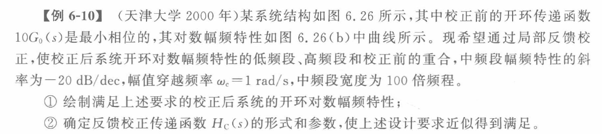
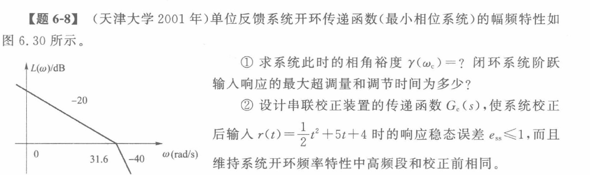

# 系统校正

## 求参数简化经验

**确定矫正方式后，设参数求解，一般不改变低频段与高频段阶次，能满足要求即可**

## 校正指标

$$
e_{ss}\quad K_p,K_v,K_a\quad \omega_c,\gamma$$
$$K_g考查要求不高$$
$$\sigma\%,t_s
\left\{\begin{array}{l}
\textcircled{1}\ 目标二阶系统反解\xi,\omega_n\\
\textcircled{2}\star高阶系统转化为\omega_c,\gamma
\end{array}\right.$$

## 三频段理论

$$低频段\left\{\begin{array}{l}
v\uparrow \\
K\uparrow
\end{array}\right.
\Rightarrow e_{ss}\downarrow，精度\uparrow\\
\ \\
中频段\left\{\begin{array}{l}
\gamma\uparrow，系统平稳性越好，\sigma\%越小\\
\omega_c\uparrow，系统快速性越好，t_s,t_p越小\\
（前提：保证稳定，即保证相角裕度足够大）
\end{array}\right.\\
\ \\
注：希望L(\omega)以-20dB/dec斜率穿越0dB，并保持较宽的频段，但不要求关于\omega_c左右对称\\
（一般拉开10倍频，此时会有相当的相角裕度；-20dB/dec\quad\star\quad\gamma\to 90\degree）\\
\ \\
高频段\quad L(\omega)\downarrow \quad\Rightarrow 抗高频干扰能力\uparrow$$

## 频域矫正注意

$$幅频特性均以\text{Bode}图折线计算，无须精确A(\omega)$$

## 符号含义注明

$$\omega_c：系统原截止频率\\
\gamma_0：系统原相角裕度\\
\ \\
\omega_m：矫正参考位置\\
\gamma_m：系统本身在参考位置的相角裕度\\
\gamma_m'：矫正后系统在参考位置的相角裕度\\
\phi_m：相角差值，非具体相频特性\\
\varphi_m：具体相角值，系统相频特性$$

## 滞后校正

**灵活结合使用**
**以校正图像把握校正步骤**
$$相角校正幅度取决于系统：附加-20dB斜率，使系统幅频特性L(\omega)减小至0$$
$$校正步骤：\\
情形一：校正稳态性能（中频段）\\
\textcircled{1}计算\omega_m\quad(\gamma_m=\gamma+6\degree)\\
\textcircled{2}L(\omega_m)=20\lg\beta反解\beta（\text{Bode}图折线）\\
\\
\textcircled{3}\ 校正后检验（\gamma_m'\geqslant\gamma）\\
\ \\
G_c(s)=\frac{\frac{s}{\omega_2}+1}{\frac{s}{\omega_1}+1}=\frac{Ts+1}{\beta Ts+1}\quad{\color{blue}(\beta>1)}\\
\omega_1=\frac{\omega_m}{10\cdot\beta },\quad \omega_2=\frac{\omega_m}{10}$$
$$情形二：校正低频段，中频段满足要求\\
\textcircled{1}确定K'\ (e_{ss};\quad K_p/K_v/K_a)，令\beta=\frac{K'}{K}（K'>K），此时\omega_m=\omega_c不变，\gamma减小少于6\degree\\
\ \\
G_c(s)=K\frac{\frac{s}{\omega_2}+1}{\frac{s}{\omega_1}+1}=\beta\frac{Ts+1}{\beta Ts+1}\quad{\color{blue}(\beta>1)}\\
\omega_1=\frac{\omega_m}{10\cdot\beta },\quad \omega_2=\frac{\omega_m}{10}$$
$$注：滞后校正不存在“耦合”问题，不必检验，但流程是必要的$$

## 超前滞后校正

**以校正图像把握校正步骤**
$$校正步骤：\\
\textcircled{1}\ 先滞后，在合适\omega_m处，挖掘系统相角\gamma_m，计算超前环节需提供的相角\phi_m=\gamma-\gamma_m+6\degree\\
\textcircled{2}\ 反解\alpha=\frac{1-\sin\phi_m}{1+\sin\phi_m}，计算\beta\quad 20\lg\beta+\underbrace{10\lg\alpha}_{<0}=L(\omega_m)，在原系统\omega_m处放置超前环节中点\\
\textcircled{3}\ 校正后检验（\gamma_m'\geqslant\gamma）$$
$$G_c(s)=\frac{\frac{s}{\omega_2}+1}{\frac{s}{\omega_1}+1}\cdot
\frac{\frac{s}{\omega_3}+1}{\frac{s}{\omega_4}+1}
=\frac{Ts+1}{\alpha Ts+1}\cdot\frac{Ts+1}{\beta Ts+1}\quad{\color{blue}(0<\alpha<1,\beta>1)}\\
\ \\
\omega_4=\frac{\omega_m}{\sqrt{\alpha}},\quad \omega_3=\omega_m \cdot\sqrt{\alpha},\quad \omega_2=\frac{\omega_m}{10},\quad \omega_1=\frac{\omega_m}{10\cdot \beta}$$
$$注：超前滞后校正不存在“耦合”问题，不必检验，但流程是必要的$$

## 超前校正

**以校正图像把握校正步骤**
$$校正步骤（最大提供超前角60\degree）：\\
情形一：\gamma不满足要求，\omega_c满足要求\\
\textcircled{1}在\omega_c处，计算所需提供的相角\phi_m=\gamma-\gamma_0+5\degree\sim 10\degree，反解\alpha=\frac{1-\sin\phi_m}{1+\sin\phi_m}\\
\textcircled{2}在原系统L(\omega_m)=10\lg\alpha{\color{blue}<0}处放置超前环节中点\\
\textcircled{3}\ 校正后检验（\gamma_m'\geqslant\gamma），若不合格，可适当增减相角偏差(5\degree\sim10\degree)，或直接调整校正装置系数（经验）$$
$$情形二：\gamma，\omega_c均不满足要求\\
\textcircled{1}首先取\omega_m满足要求，计算\alpha\quad L(\omega_m)=10\lg \alpha{\color{blue}<0}，检验(\gamma_m'\geqslant \gamma)\\
\textcircled{2}若不满足，\omega_m再适当往大取$$
$$G_c(s)=\frac{\frac{s}{\omega_1}+1}{\frac{s}{\omega_2}+1}=\frac{Ts+1}{\alpha Ts+1}\quad{\color{blue}(0<\alpha<1)}\\
\omega_1=\omega_m\sqrt{\alpha},\quad \omega_2=\frac{\omega_m}{\sqrt{\alpha}}$$
$$\phi_m=\arcsin\frac{1-\alpha}{1+\alpha},\quad \alpha=\frac{1-\sin \phi_m}{1+\sin \phi_m}$$
$$注：超前校正存在“耦合”问题，必须检验$$

## 校正方案选择

$$根据系统特征与要求，依{\color{blue}直觉选择}合适校正方案；
无需倾向，否则浪费时间$$

## 速度反馈或微分反馈校正

$$K(\neq0),k_f任取均为典型二阶系统$$

$$“子闭环”反馈\beta s\\
速度反馈(\beta s)校正后仍为典型二阶系统$$

## 非主要校正方法

$$反馈校正：整理为传函，具体情况具体分析（影响稳定性，影响动态性能）\\
\ \\
\text{PID}校正：一般校正方式已知，反解参数\\
\ \\
希望特性校正：方法简单，辅助方法，或三大校正失效时使用$$

## K未知校正典例

$$思路一：校正中频段；\quad  根据K_v直接确定K，对G_0'(s)进行校正$$
$${\color{grey}思路二：校正低频段；\quad确定\gamma满足要求的截止频率，解得K}$$
$$注：K未知的校正题型
\left\{\begin{array}{l}
\textcircled{1}\ 先确定K，再对中频段进行校正\\
\textcircled{2}\ 先确定满足中频要求的K^*，再对低频段进行校正
\end{array}\right.以\textcircled{1}为准，暂不区分，幅频的上下平移$$

## 超前滞后校正与希望特性结合典例

**要求不苛刻时，此法校正速度最快**

$$\omega_c=2\sqrt{3},\quad\gamma=0\degree\\
\ \\
\frac{\omega_c}{\omega_3}=\frac{\omega_4}{\omega_c}=\sqrt{10};\qquad \omega_2=\frac{\omega_c}{10};\qquad
A(\omega_c)=\frac{12\cdot\frac{\omega_c}{\omega_2}\cdot\frac{\omega_c}{\omega_3}}{\omega_c^2\cdot\frac{\omega_c}{\omega_1}}=1$$

## 反馈校正与希望特性结合典例

## 串联校正典例

**希望特性的思想**

$$G(s)=\frac{31.6}{s(\frac{s}{31.6}+1)}\\
\textcircled{2}\quad e_{ss}\leqslant1，故系统v\geqslant2，设计G_c(s)=\frac{s+1}{s}\qquad (s+1)“妙”\quad“轴点”(1,20\lg K)$$
