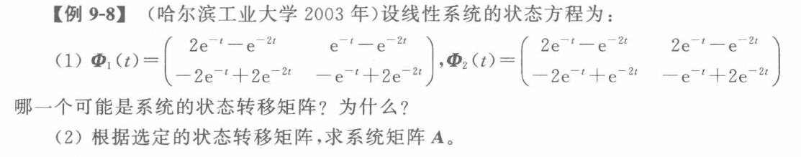

# 状态空间表达式的解

## 连续状态转移矩阵及其性质

$$
定义：x(t)=\Phi(t)x_0=e^{At}x_0\\
e^{At}=I+At+\frac{1}{2!}A^2t^2+\cdots+\frac{1}{n!}A^nt^n+\cdots$$
$$\begin{array}{ll}
性质一：\Phi(t)\Phi(\tau)=\Phi(t+\tau)\quad & 即e^{At}e^{A\tau}=e^{A(T+\tau)}\\
\ \\
性质二：\Phi(t-t)=I\quad &即e^{A(t-t)}=\Phi(0)=I\\
\ \\
性质三：[\Phi(t)]^{-1}=\Phi(-t)\quad &即[e^{At}]^{-1}=e^{-At}\\
\ \\
性质四：\dot{\Phi}(t)=A\Phi(t)=\Phi(t)A &
\dot{\Phi}(0)=A\\
\ \\
性质五：当且仅当AB=BA时，e^{At}e^{Bt}=e^{(A+B)t} &（对于n\times n方阵A,B）
\end{array}$$
$$注：e^{At}为一种记法，与指数运算高度统一$$

## 状态转移矩阵的计算

**考研考查最多三维矩阵，灵活选择使用**
$$变换为对角线标准型：T^{-1}AT=\Lambda\\
{\color{blue}前提：可相似对角化}\\
\Phi(t)=e^{At}=T(I+\Lambda t+\frac{1}{2!}\Lambda^2t^2+\cdots+\frac{1}{n!}\Lambda^nt^n+\cdots)T^{-1}=
T
\left(
\begin{array}{}
e^{\lambda_1t}&\\
&e^{\lambda_2t}\\
&&\ddots\\
&&&e^{\lambda_nt}
\end{array}
\right)
T^{-1}$$

$$拉氏反变换（阶次\leqslant 3时）：e^{At}=\mathscr{L^{-1}}[(sI-A)^{-1}]\quad （实则对矩阵中元素\mathscr{L}^{-1}）\\
sX(s)-x(0)=AX(s)\\
x(t)=\mathscr{L}^{-1}[(sI-A)^{-1}]x(0)$$

## 线性定常非齐次的解

$$x(t)=\underbrace{\Phi(t)x(0)}_{初始状态转移}+\underbrace{\int_0^t\Phi(t-\tau)Bu(\tau)d\tau}_{激励状态转移}\quad (实则对矩阵中元素积分)$$
$$推导：sX-x(0) =AX(s) + BU(s) \\
\Rightarrow (sI-A)X(s)=x(0)+BU(s)\\
\Rightarrow X(s)= (sI-A)^{-1}x(0)+ \underbrace{(sI-A)^{-1}BU(s)}_{\mathscr{L}^{-1}略}$$

## 离散定常非齐次的解

$$\begin{array}{rl}
x(k)&=\underbrace{G^kx(0)}_{初始状态转移}+\underbrace{\sum_{j=0}^{k-1}G^{(k-1)-j}Hu(j)}_{激励状态转移}\\
\ \\
&=G^{k}x(0)+G^{k-1}Hu(0)+G^{k-2}Hu(1)+\cdots++GHu(k-2)+Hu(k-1)
\end{array}$$

## 状态转移矩阵反解系统

**考查状态转移矩阵的性质**

$$\Phi(0)=I\quad \dot{\Phi}(0)=A（或A=\dot{\Phi}(t)\Phi(-t)）$$

## 求解状态转移矩阵典例

$$e^{At}
\left(\begin{array}{l}
1&2\\
-1&-1
\end{array}\right)=
\left(\begin{array}{}
e^{-2t}&2e^{-2t}\\
-e^{-2t}&-e^{-t}
\end{array}\right)\\
e^{At}=\left(\begin{array}{}
e^{-2t}&2e^{-2t}\\
-e^{-2t}&-e^{-t}
\end{array}\right)
\left(\begin{array}{l}
1&2\\
-1&-1
\end{array}\right)^{-1}$$
